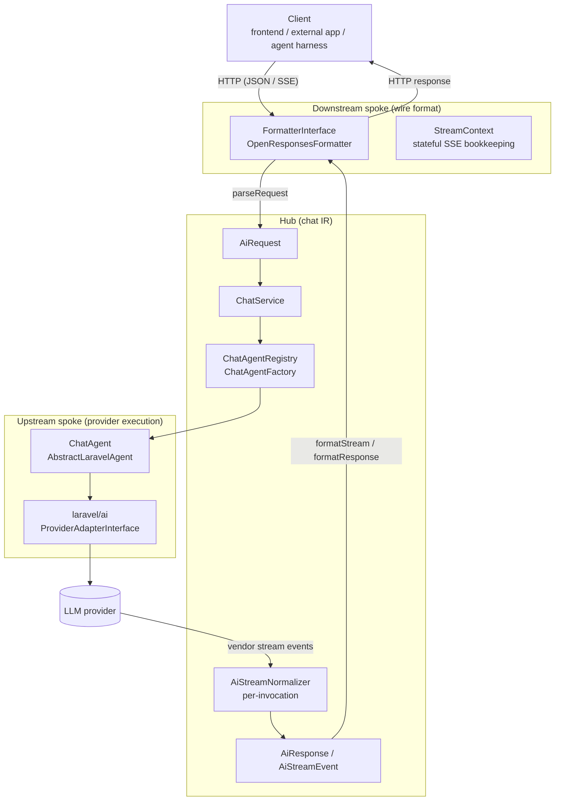
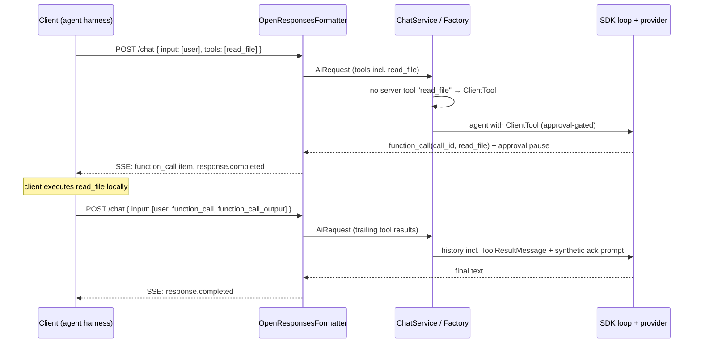

# The Chat Proxy: Hub-and-Spoke Architecture

> Status: **As built** — documents the shipped state of the generic chat proxy
> (commits `47644632`, `8094cfe0`, `aeed3561`).
> The companion document [`001-generic-llm-backend.md`](./001-generic-llm-backend.md) is the
> original *proposal*; this article describes what actually exists in the code today, why it
> is shaped this way, and where you are expected — and not expected — to extend it.
>
> Background reading for the surrounding AI stack:
> [_documentation/500-Backend/500-AI-Service-Layer](./_documentation/500-Backend/500-AI-Service-Layer/index.md).

---

## 1. The problem this solves

HAWKI speaks to two different worlds, and both of them speak many dialects.

On one side are the **clients**: the Svelte frontend, external apps, and — increasingly —
agent harnesses (coding agents, CLI tools) that want to talk to an LLM through HAWKI. Each
of them has a preferred wire format: OpenAI Responses, OpenAI Chat Completions, and
HAWKI's own legacy NDJSON are the obvious candidates, and more will follow.

On the other side are the **providers**: OpenAI, Anthropic, Gemini, Ollama, and the rest,
each with their own request/response dialect. This side is already solved — the
`laravel/ai` SDK plus HAWKI's `ProviderAdapterInterface` layer (see
[Provider Adapters](./_documentation/500-Backend/500-AI-Service-Layer/100-Provider-Adapters.md))
normalize all of them behind one agent API.

If every client format had to know about every provider dialect, you would need
N × M converters, each drifting independently. The chat proxy avoids this by inserting a
**hub**: a provider-neutral intermediate representation (IR). Each client format is one
*spoke* that translates wire ⇄ IR; each provider is another spoke behind `laravel/ai`.
Adding a client format costs one formatter, not M patches.

Two properties define the system and should never be quietly violated:

1. **The proxy is stateless.** It stores no conversation history. Clients hold all state
   and re-send the full history every turn. Stateful protocol features
   (`store: true`, `previous_response_id`, compaction) are rejected with explicit errors —
   a client that depends on server-side chaining gets a loud failure, never a silently
   wrong answer.
2. **Vendor types and wire types never cross the hub.** `Laravel\Ai\*` classes do not
   appear in formatters; wire-format arrays do not appear in services. Everything meets
   in the IR, and only in the IR.

---

## 2. Architecture overview



| Layer | Namespace | Responsibility |
|---|---|---|
| Upstream spoke | `Laravel\Ai\*` + `App\Services\Ai\Providers\*` | Talk to LLM providers. Owned by the SDK and the existing adapter layer; the proxy does not touch it. |
| Hub | `App\Services\Ai\Chat\*` | The IR (`Values/`), the execution service (`ChatService`), the agent factory chain, and the normalizer that converts vendor output into IR. |
| Downstream spoke | `App\Services\Ai\Formatters\*` | Translate one client wire format ⇄ IR. One class per format, registered by key. |

The single HTTP entry point is deliberately thin:

```
POST /api/hawki/v1/chat/{format?}      (default format: openResponses)
```

```php
// app/Http/Controllers/Api/V1/ChatController.php — the whole controller, essentially
$formatter = $this->formatters->resolve($format);
$aiRequest = $formatter->parseRequest($request);

if ($aiRequest->wantsStreaming()) {
    return $formatter->formatStream($this->chatService->sendStreaming($aiRequest));
}

return $formatter->formatResponse($this->chatService->send($aiRequest));
```

Everything interesting happens before and after these lines.

---

## 3. The hub: the chat IR

All IR types live in `app/Services/Ai/Chat/Values/` and follow one set of conventions:

- `readonly` classes with promoted public properties, factories like `fromText()` where useful.
- Discriminated by a `TYPE` (parts, stream events) or `ROLE` (messages) string constant,
  so `match`/`instanceof` dispatch works and PHPStan can narrow unions.
- Marker interfaces (`ContentPart`, `Message`, `AiStreamEvent`) exist purely so unions can
  be typed as arrays.

### 3.1 Envelope types

| Type | Role |
|---|---|
| `AiRequest` | The whole request in provider-neutral form: model, messages, system instruction, tools, tool choice, generation/reasoning/stream configs, plus the escape hatches below. |
| `AiResponse` | A single completed response: id, model, one assistant message, finish reason, usage. Single-choice by design — the SDK underneath is single-response. |
| `AiStreamEvent` union | The normalized stream: `StreamStartEvent`, `ContentBlockStart/EndEvent`, `TextDeltaEvent`, `ReasoningDeltaEvent`, `ToolCallStart/DeltaEvent`, `UsageEvent`, `FinishEvent`, `StreamEndEvent`, and the `hawki:` extension events. |

### 3.2 Content parts and messages

Parts (`Values/Parts/`) are the atomic content units: text, image, file, audio, tool call,
tool result, reasoning, refusal, citation. Messages (`Values/Messages/`) are role-scoped
containers: `SystemMessage`, `UserMessage`, `AssistantMessage`, `ToolMessage` — each
constraining which parts it may carry.

### 3.3 The three escape hatches

An IR modeled on "the union of all formats" still meets fields nobody predicted. The
system has three sanctioned overflow valves, in the order you should reach for them:

1. **`providerMetadata` / `providerExtensions`** — opaque arrays on parts and envelopes,
   tagged by the formatter that captured them. Anything a wire format expresses that the
   IR does not model natively rides here.
2. **`hawki:` extension events and the `hawki` request object** — HAWKI-specific stream
   events (`hawki:citation`, `hawki:provider_tool_event`) and request metadata (see §5.3).
   These follow the Open Responses extension convention: unknown types are ignorable by
   any compliant client.
3. **New IR types** — when a capability genuinely cannot ride in the above, you add a new
   `readonly` class. This is a deliberate, reviewed change: every formatter that does not
   support the new type will drop it, so it must be worth it.

`AiRequest::$hawkiExtensions` is the request-side valve for HAWKI-specific concerns:
tool-transfer strings, attachment UUIDs, legacy model params, and (in the future, per the
proposal) assistant routing handles. Factories inspect it to claim requests; the IR itself
stays wire-format-neutral.

---

## 4. Downstream spokes: formatters

### 4.1 The contract

```php
// app/Services/Ai/Formatters/Contracts/FormatterInterface.php
interface FormatterInterface
{
    public function getKey(): string;
    public function parseRequest(Request $request): AiRequest;
    public function formatResponse(AiResponse $response): JsonResponse;
    public function formatStream(iterable $events): StreamedResponse;
    public function getStreamHeaders(): array;
    public function formatError(FormatterRequestException $exception): Response;
}
```

A formatter knows exactly one wire format and the IR — nothing else. It never sees a
`laravel/ai` class, a model, or the database.

### 4.2 The registry

`FormatterRegistry` (`app/Services/Ai/Formatters/FormatterRegistry.php`) maps string keys
to formatter classes, resolves them lazily from the container, and falls back to
`FormatterRegistry::DEFAULT_KEY` (`'openResponses'`). Built-ins are declared in
`AiServiceProvider::register()`:

```php
$this->app->extend(
    FormatterRegistry::class,
    fn (FormatterRegistry $registry) => $registry
        ->declare(OpenResponsesFormatter::KEY, OpenResponsesFormatter::class)
);
```

Plugins register additional formats the same way via `$app->extend()`. An unknown format
segment in the URL falls back to the default formatter rather than failing the request.

### 4.3 The reference implementation: `OpenResponsesFormatter`

`app/Services/Ai/Formatters/Implementations/OpenResponses/` contains the one shipped
formatter. It is the reference for how a formatter behaves, and it is spec-complete for
the stateless subset of Open Responses:

- **`parseRequest`** maps `input` items to IR messages (`message`, `function_call`,
  `function_call_output`, `reasoning`), `instructions` to the system instruction, `tools`
  / `tool_choice` / `reasoning` / `text.format` / sampling params to their configs, and
  the top-level `hawki` object to `hawkiExtensions`. It enforces the proxy's two
  stateless rejections (`store: true` → 400 `store_not_supported`,
  `previous_response_id` → 404 `previous_response_not_found`) and the continuation rule
  (input must end with a user message or a `function_call_output`).
- **`formatResponse`** emits the full 31-field `ResponseResource` — every field present,
  nullable where the spec allows — via the shared `OpenResponsesResource` assembler.
- **`formatStream`** delegates per-event translation to `OpenResponsesStreamContext`
  (below), renders `event:` + `data:` frames, and terminates with `data: [DONE]`.
  Any exception during iteration becomes SSE `error` + `response.failed` events — the
  stream never dies mid-flight without telling the client.
- **`formatError`** renders `FormatterRequestException`s in the OpenAI error body shape.

### 4.4 `OpenResponsesStreamContext`

Streaming translation is stateful by nature: the wire format demands monotonic
`sequence_number`s, explicit output-item and content-part lifecycles, accumulated
tool-call arguments, and usage/finish information that appears exactly once, in the
terminal event. All of that bookkeeping lives in
`OpenResponsesStreamContext` — one instance per response, owned by the formatter.
One IR event maps to 0..n frames. If you write a streaming formatter, plan the
equivalent context class first; it is where the format's real complexity lives.

---

## 5. Cross-cutting wire conventions

### 5.1 Error mapping

| Situation | Result |
|---|---|
| Formatter-level parse errors (`FormatterRequestException` subclasses) | Wire-format error body via `formatError()`, status from the exception (400/404). |
| Unknown model (`ModelIdNotAvailableException`) | 404 `model_not_found` in the wire error shape. |
| Model hallucinated a tool name (`NoSuchToolException`) | 400 `unknown_tool` (non-streaming); SSE `error` + `response.failed` (streaming). |
| Failure during streaming | SSE `error` event followed by `response.failed`, then `[DONE]`. |

### 5.2 Token usage recording

Usage is recorded by event listeners (`App\Services\Ai\Listeners\RecordUsageForAgentResponse`,
`…ForAgentStreamCompleted`) on the agent lifecycle events, **not** in the controller. To
prevent double-counting with the legacy `StreamController` (which submits its usage
explicitly on the same underlying events), `AgentRequestContext` carries a
`usageRecordedViaListener` flag. The factory chain sets it for proxy invocations; the
listeners record only flagged invocations and then dispatch `UsageRecordedEvent` with the
full channel context. When `StreamController` is eventually retired, the flag and the
explicit submissions go with it.

### 5.3 The `hawki` request object

Clients that need HAWKI-specific behavior send a top-level object alongside the spec
fields. This is spec-legal (Open Responses allows supersets) and parsed into
`AiRequest::$hawkiExtensions`:

```json
{
  "model": "gpt-4.1-nano",
  "input": [ ... ],
  "hawki": {
    "tools": ["capability:web_search:auto"],
    "attachments": ["<stored-file-uuid>"],
    "params": { "temp": 0.1 }
  }
}
```

| Key | Meaning |
|---|---|
| `tools` | HAWKI tool-transfer strings, resolved server-side via the existing `ChatToolResolver` (capabilities, MCP/PHP tools). |
| `attachments` | HAWKI stored-file UUIDs attached to the final user turn (private or group storage). |
| `params` | Legacy model parameters (`temp`, `top_p`, `max_tokens`, `max_thinking_tokens`). |

### 5.4 The `maxSteps` seam

The SDK's tool loop runs `1.5 × tool count` steps by default (min 5 without tools).
`AbstractTextGeneratingAgent::MAX_TOOL_CALLING_STEPS` exposes this as a named, currently
non-configurable constant read by the SDK through the agent's `maxSteps()` method. The
`@todo` on the constant marks the planned connection to the per-model
`WellKnownModelSettings::MAX_TOOL_CALLING_ROUNDS` (and its streaming variant). Until that
lands, do not special-case the value per model — the SDK's dynamic default is better than
a wrong constant.

---

## 6. Tool calling: two execution models

This is the part of the proxy most worth understanding, because it decides where a tool
call *runs*.

**Model 1 — server-executed tools.** Anything HAWKI knows: transfer-string tools from
`hawki.tools`, and spec-declared `function` tools whose name matches a tool registered on
the model (`$context->model->tools`). These resolve through `LaravelToolResolver`; the
SDK loop executes them mid-generation and the model keeps going. The stream surfaces
them as `function_call` items plus a `hawki:provider_tool_event` for visibility.

**Model 2 — client-executed tools.** A spec-declared tool the server cannot map (a coding
agent's `read_file`, say) is wrapped in `ClientTool` (`app/Services/Ai/Chat/Tools/`).
`ClientTool` implements the SDK's `Approvable` contract and *always* requires approval —
which is the SDK's designed pause primitive: the loop emits the model's call, then stops
without executing. The proxy streams the untouched `function_call` (with its `call_id`
and arguments) to the client, ends the response with finish reason `tool_calls`, and the
client executes the tool locally.

The routing rule in `ChatAgentFactory::buildTools()` is one sentence:
**if the server knows the name, intercept; otherwise wrap in `ClientTool` and hand off.**
Duplicated names (transfer string + spec declaration) resolve once.

### 6.1 The handoff loop, end to end



### 6.2 Call-id plumbing (read this before touching tool code)

Two id concepts must not be confused, and the SDK names them confusingly:

- The **wire `call_id`** — what the model emits and the client must echo back in
  `function_call_output`. In vendor DTOs this is `ToolCall::$resultId` /
  `ToolResult::$resultId`, *not* `->id`.
- The **provider item id** (`fc_…` for OpenAI) — vendor `ToolCall::$id`. OpenAI requires
  replayed `function_call` items to carry an `fc_`-prefixed id.

The proxy's conventions, enforced in `AiStreamNormalizer::wireCallId()` and
`ChatAgentFactory::providerItemId()`:

- outbound to clients: wire call id is always `resultId ?? id`;
- replayed history: `resultId` = the client's `call_id`, `id` = `fc_`-prefixed.

Break either and the next provider request returns a 400 about `input[n].id`.

### 6.3 Continuation turns

The SDK always appends the prompt string as a final user message, so a turn that
continues after tool results cannot literally end on `function_call_output`. The proxy
keeps the trailing tool results in the conversation history as a `ToolResultMessage` and
adds one small synthetic acknowledgement user turn (`MessageMetaBlocks` block
`Tool Results Delivered`). This is a deliberate, documented deviation: it works
identically on every provider driver, at the cost of one tiny extra user turn per loop
iteration.

---

## 7. The hub services

### 7.1 `ChatService`

`App\Services\Ai\Chat\ChatService` is the programmatic surface — `@api`, HTTP-free:

```php
$chatService = app(ChatService::class);
$aiRequest   = /* build or parse */;
$response = $chatService->send($aiRequest);          // AiResponse
$events   = $chatService->sendStreaming($aiRequest); // iterable<AiStreamEvent>, lazy
```

Anything that needs an LLM call from PHP (jobs, commands, the future group-chat
orchestration refactor) goes through here, not through the controller.

### 7.2 The factory chain

`ChatAgentRegistry` (`app/Services/Ai/Chat/Factories/`) resolves an agent for an
`AiRequest` by iterating registered factories in topological order — first non-null agent
wins. Factories implement `ChatAgentFactoryInterface`:

```php
public function createAgent(AiRequest $request): ?AgentInterface;
```

Returning `null` means "not mine". `declare()` accepts `before:`/`after:` constraints,
which is how a future `AssistantAgentFactory` (claiming requests via
`hawkiExtensions.assistant_handle`) will take priority over the default
`ChatAgentFactory` without the default knowing about it.

`ChatAgentFactory` itself is the default spoke-to-agent translator: model resolution
(explicit slug or system default), parameter mapping (generation config + reasoning
budget + `hawki.params`), instruction assembly, history mapping (including the tool-loop
conventions of §6), attachment resolution (stored-file UUIDs and inline/URL parts), and
tool routing.

### 7.3 `AiStreamNormalizer`

The normalizer (`app/Services/Ai/Chat/AiStreamNormalizer.php`) is the upstream side of
the hub: it consumes `Laravel\Ai\Streaming\Events\*` and yields `AiStreamEvent`s, one
vendor event mapping to 0..n IR events. It also converts completed `AgentResponse`s into
`AiResponse`s for the non-streaming path.

Two properties matter:

- **Per-invocation lifetime.** Block indices and tool-call counters are mutable state.
  The normalizer is therefore created fresh for every call by
  `AiStreamNormalizerFactory` — never injected as a singleton.
- **Privacy policy lives here.** `CitationUrlCleaner` runs inside the normalizer, so
  every formatter receives already-sanitized citation URLs without knowing about it.

---

## 8. The frontend client

The new frontend talks exclusively to the proxy. The kernel client
(`resources/js/kernel/ai/openResponses/OpenResponsesApi.ts`, exposed as `app.chatApi` /
`useChatApi()`) owns:

- an incremental SSE line parser over the shared `ApiTransport` stream support,
- the request builder (history → `input` items, `instructions`, the `hawki` object),
- `stream()` / `collect()` / `text()` / `send()` conveniences.

`ChatTransport` (`resources/js/plugins/core/modules/chat/transport/ChatTransport.ts`)
maps the SSE events onto chat-store patches: text deltas update the message body,
reasoning/tool events update the status line, `hawki:citation` appends sources, terminal
events close or fail the exchange. Client-side encryption and persistence are unchanged —
they were always the client's job.

The legacy `AiApi` (NDJSON, `/req/streamAI`) remains in the kernel for the old UI but is
no longer called by the new frontend, including title generation and prompt improvement.

---

## 9. What is an extension point — and what is not

### 9.1 Open for extension

| To add… | Implement… | Register… |
|---|---|---|
| A client wire format (e.g. `openaiChatCompletions`, `anthropicMessages`) | `FormatterInterface` (+ a stateful `StreamContext` if it streams) | `$app->extend(FormatterRegistry::class, fn ($r) => $r->declare('<key>', MyFormatter::class))` |
| A request-claiming factory (e.g. assistant routing) | `ChatAgentFactoryInterface` | `$app->extend(ChatAgentRegistry::class, …)` with `declare(before: ChatAgentFactory::class)` |
| A capability the IR lacks | Prefer, in order: `providerMetadata` / `providerExtensions` → a `hawki:` extension event → a new IR type | — |

**Checklist — adding a wire format** (the by-the-book path):

1. Study the target spec's request, response, SSE, and error shapes. Find or write its
   acceptance tests.
2. Map every field to the IR. Anything unmapped goes into `providerExtensions` (tagged
   with your format key), not into a new IR field.
3. Implement `parseRequest` and the non-streaming `formatResponse` first; round-trip them
   against fixtures (wire → IR → wire, structural equality).
4. Design the `StreamContext`: sequence numbers, item/part lifecycles, argument
   accumulation, deferred usage/finish. One IR event → 0..n frames.
5. Implement `formatError` and `getStreamHeaders`; make mid-stream failures terminate
   cleanly in the format's own error convention.
6. Add feature tests against a faked agent stream (see
   `tests/Feature/Api/Chat/ChatEndpointTest.php` for the harness pattern) and unit tests
   for the context (see `OpenResponsesStreamContextTest`).
7. Register the formatter in `AiServiceProvider` (core) or via `$app->extend` (plugin).

### 9.2 Fixed by the current architecture

These are load-bearing. Change them only with the design doc in hand:

- **The IR boundary.** Formatters consume `AiRequest`/`AiResponse`/`AiStreamEvent` and
  nothing else; services consume the same and never see wire arrays. The normalizer is
  the only code allowed to touch vendor stream events.
- **The `ChatService` surface** (`send`, `sendStreaming`, `getAgent`). It is `@api`;
  orchestration (encryption, persistence, broadcast) wraps it, it does not grow
  orchestration.
- **Stateless invariants.** `store`/`previous_response_id` rejections, full-history
  resends, and the trailing-item rule live in formatters and are part of the contract.
- **Call-id conventions** (§6.2) — provider-verified, not stylistic.
- **The single provider execution path.** Everything goes through
  `AbstractLaravelAgent`/`laravel/ai`. Do not add provider HTTP calls beside it.
- **Usage ownership semantics** (§5.2) — remove the flag only together with the last
  explicit `submitUsageRecord()` caller.

---

## 10. Known limitations

- **`maxSteps`** is the SDK default behind a constant; per-model wiring is `@todo`
  (§5.4). Long mixed tool loops can exhaust the budget and receive synthetic
  "maximum steps" tool results.
- **Continuation turns** carry one synthetic ack user turn (§6.3) — a documented
  deviation from native Responses continuation.
- **Client tool schemas** outside the `illuminate/json-schema` subset degrade to a
  described string parameter (logged); the tool still works.
- **Single choice only** — `n > 1` requests get the first choice; the underlying SDK is
  single-response.
- **Group-chat orchestration** (encryption, persistence, broadcast) still lives in the
  legacy `StreamController` and is explicitly *not* the proxy's job; the migration plan
  is §11 of the proposal doc.

---

## 11. Compliance suite

The Open Responses acceptance tests run as a PHPUnit feature suite:
`tests/Feature/Api/Compliance/OpenResponsesComplianceTest.php` — a port of the official
test definitions (`research/openresponses/src/lib/compliance-tests.ts`), validating every
response and SSE event against the published spec
(`research/openresponses/public/openapi/openapi.json`) via `opis/json-schema`, plus the
streaming ordering rules (item/part lifecycle, monotonic `sequence_number`, `[DONE]`).

- **In scope (8):** basic-response, assistant-phase, response-output-phase-schema,
  streaming-response, system-prompt, tool-calling, image-input, multi-turn. The
  multi-turn test sends full history — the stateless reading — and passes.
- **Excluded:** the `websocket-*` and `compact-*` tests (stateful protocol features the
  proxy deliberately rejects).
- **Gating:** the suite talks to a real provider (gpt-4.1-nano) and is **skipped by
  default**; it runs only when `OPENRESPONSES_COMPLIANCE_TOKEN` is non-empty:

  ```bash
  OPENRESPONSES_COMPLIANCE_TOKEN=sk-… bin/env php vendor/bin/phpunit \
      --testsuite feature --filter OpenResponsesComplianceTest
  ```

- **CI:** `.github/workflows/ai-compliance.yml` runs it on PRs touching the AI surface;
  an empty `OPENRESPONSES_COMPLIANCE_TOKEN` secret keeps the job green (skipped), a
  populated one verifies against the real provider.

One documented fixture deviation: the official 32×32 image PNG is rejected by OpenAI's
current image validation for every model, so the port sends a 128×128 PNG with identical
intent (byte-identical forwarding verified).

The same CI workflow also runs the Chat Completions live suite
(`tests/Feature/Api/Chat/ChatCompletionsLiveTest.php`, same token gate): chunk grammar,
client-tool loop, and generation-param wiring against gpt-4.1-nano.

### Citations

Citations are **spec-native in openResponses**: streamed as
`response.output_text.annotation.added` events (url_citation annotations) and carried on
the message item's `output_text.annotations[]` in part/item lifecycle frames and the
final resource — no custom frames. (The earlier `hawki:citation` extension was removed
in favor of this native mapping.) The `openai` format has no native citation slot, so
its formatter emits a custom `hawki:citation` data frame, guarded by the switch below.

### Custom (non-standard) events

Where a wire format has no native slot for HAWKI data (citations in `openai`,
provider-tool events), the formatters emit non-standard `hawki:` frames. This emission
is globally switchable: `AI_PROXY_EMIT_CUSTOM_EVENTS=false` (default `true`, config
`hawki.aiProxy.emit_custom_events`) suppresses every custom emission in every format for
strict-spec clients. The IR keeps the data either way; the switch only acts at the
formatter boundary.

---

## 12. References

- Implementation record (deviations, next steps): [`001-generic-llm-backend-implementation.md`](./001-generic-llm-backend-implementation.md)
- Proposal and phase plan: [`001-generic-llm-backend.md`](./001-generic-llm-backend.md)
- IR heritage: [LLM-Rosetta](https://arxiv.org/html/2604.09360v1) (paper; working copy in
  `research/llm-rosetta/`) — hub-and-spoke IR, ops composition, stream contexts,
  round-trip fidelity testing.
- Wire spec: Open Responses (`research/openresponses/`, spec version `2026-04-24`) —
  `ResponseResource` schema, SSE event catalog, extension conventions.
- Surrounding system: [_documentation/500-Backend/500-AI-Service-Layer/](./_documentation/500-Backend/500-AI-Service-Layer/index.md)
- Tests as usage examples:
  `tests/Feature/Api/Chat/ChatEndpointTest.php`,
  `tests/Unit/Services/Ai/Chat/`, `tests/Unit/Services/Ai/Formatters/`.
