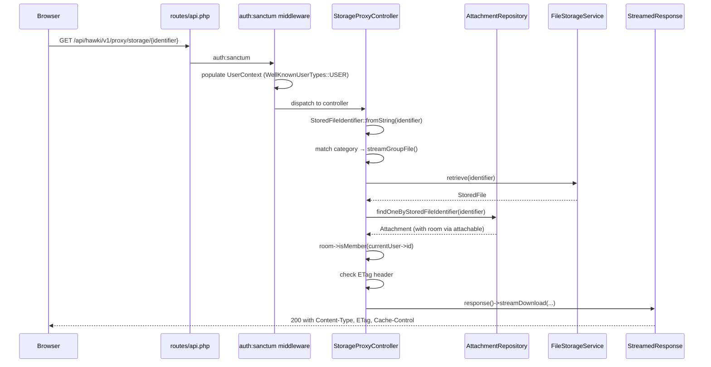

# Life of a Request

This tutorial walks a single HTTP request end-to-end, from the browser to the streaming response. Every layer gets one turn in the spotlight — enough to understand what it does and why it exists, without drowning in implementation detail.

:::tip[Why this example?]
We follow a file-download request through `StorageProxyController`. It is one of the cleanest controllers in the codebase: one constructor, one public method, four private helpers, zero business logic, zero direct DB queries. The architecture the tutorial describes matches what you will find in the code.

Why not the AI streaming path? `StreamController.handleGroupChatRequest` is architecturally more interesting but currently mixes domain logic, encryption, and broadcasting in a 130-line method with inline validation. The [Technical Debt Register](./100-Architecture/300-Technical-Debt.md) documents this. Showing it as the tutorial example would teach the wrong pattern. The AI path is covered end-to-end in [AI Service Layer](./500-AI-Service-Layer/index.md).
:::

## Scenario

A logged-in user is in a group room. Their browser requests a file attachment. The request URL looks like:

```
GET /api/hawki/v1/proxy/storage/group-550e8400-e29b-41d4-a716-446655440000.pdf
```

The `group-` prefix is the file category. The UUID identifies the stored file. We follow it all the way to the `StreamedResponse`.

---

## Sequence diagram



---

## Step 1 — Browser to route

The request hits `routes/api.php`. This is not a JSON:API route — the storage proxy sits outside the `JsonApiRoute::server('v1')` block and is registered directly:

```php
Route::middleware(['auth:sanctum', ...])
    ->group(function () {
        Route::group(['prefix' => Server::BASE_URL_PREFIX], function () {
            Route::get('/proxy/storage/{identifier}', [StorageProxyController::class, 'streamRouted'])
                ->where(['identifier' => '.*']);
        });
    });
```

The `auth:sanctum` middleware handles session authentication. It also exists in `routes/web.php` under slightly different middleware (the web route is guarded by `signature_check` too). For the API path, Sanctum validates the session cookie and sets `Auth::user()` — which then feeds `UserContext`.

## Step 2 — Middleware and `UserContext`

`UserContext` (`App\Services\System\UserTypes\UserContext`) is a request-scoped singleton populated by middleware before any controller sees the request. It carries **who** is calling as a `WellKnownUserTypes` token: `GUEST` (default), `REGISTERING_USER`, `USER`, or `EXTERNAL_APP`.

`UsageContext` (`App\Services\System\UsageTypes\UsageContext`) is populated alongside it. It carries **which surface** the request comes from: `MAIN_APP` or `EXTERNAL_APP`. Contextual scopes and AI dispatch both read `UsageContext` to apply the right filtering.

The rest of the system trusts these singletons because they are written exactly once, early in the middleware stack, and are read-only thereafter. No service needs to call `Auth::user()` — they receive the already-resolved context via constructor injection.

## Step 3 — `StorageProxyController`

The controller is constructor-injected with everything it needs:

```php
public function __construct(
    private readonly CacheBusterGenerator $cacheBusterGenerator,
    private readonly AvatarStorageService $avatarStorage,
    private readonly AttachmentRepository $attachmentService,
    private readonly FileStorageService   $fileStorageService,
    #[CurrentUser]
    private readonly User                 $currentUser
) {}
```

Note `#[CurrentUser]`. This is a Laravel contextual attribute that resolves the authenticated user from the container, not `Auth::user()`. The controller never touches a facade.

The single public method `streamRouted()` parses the identifier string and dispatches to a private method based on the file category:

```php
public function streamRouted(Request $request, string $identifierString): StreamedResponse
{
    try {
        $identifier = StoredFileIdentifier::fromString($identifierString);
    } catch (InvalidStorageFileIdentifierStringGivenException) {
        abort(400, 'Invalid file identifier');
    }

    return match ($identifier->category) {
        StoredFileCategory::ROOM_AVATAR, StoredFileCategory::PROFILE_AVATAR => $this->streamAvatar($request, $identifier),
        StoredFileCategory::GROUP  => $this->streamGroupFile($request, $identifier),
        StoredFileCategory::PRIVATE => $this->streamPrivateFile($request, $identifier),
    };
}
```

Zero business logic. Zero DB queries. One `match` expression that routes to the correct handler.

## Step 4 — Authorization

For a `GROUP` file, the private method `streamGroupFile()` handles authorization inline:

```php
private function streamGroupFile(Request $request, StoredFileIdentifier $identifier): StreamedResponse
{
    $file = $this->getFileOrFail($this->fileStorageService, $identifier);

    $attachable = $this->attachmentService->findOneByStoredFileIdentifier($identifier)?->attachable;
    if (!$attachable instanceof Message) {
        abort(400, 'Invalid request, attachment is not linked to a message');
    }

    $room = $attachable->room;

    if (!$room->isMember($this->currentUser->id)) {
        abort(403, 'You are not a member of the room this attachment belongs to');
    }

    return $this->createStreamResponse($request, $file);
}
```

Authorization is not delegated to a `FormRequest` here. The reason: the authorization decision (`isMember`) depends on a DB lookup (`findOneByStoredFileIdentifier` → `attachable` → `room`). A `FormRequest`'s `authorize()` method runs before the request reaches the controller, so the room data would not be available yet without an extra query.

There is no hard rule that authorization always belongs in `FormRequest`. The rule is: **delegate validation of the request *shape* to `FormRequest`; handle authorization that requires domain data in the controller, or in a Laravel Policy.** This controller follows that rule.

## Step 5 — Repository

The controller calls `AttachmentRepository::findOneByStoredFileIdentifier()`. The repository issues the Eloquent query; the controller never touches `Attachment::where(...)` directly.

This matters because:
- Repositories are injectable and mockable. Models are not.
- A repository query can be tested in isolation with a mock.
- Services and controllers that only call repository methods are testable without a real database.

## Step 6 — Response

After the membership check passes, `getFileOrFail()` calls `FileStorageService::retrieve()`, which returns a `StoredFile` value object. The controller then calls `createStreamResponse()`:

```php
private function createStreamResponse(Request $request, StoredFile $file): StreamedResponse
{
    $etag = $this->cacheBusterGenerator->getEtag($file->getEtag());

    if ($request->headers->get('if-None-match') === $etag) {
        abort(304);
    }

    $stream = $file->getStream();
    if (!$stream) {
        abort(404, 'File not found');
    }

    return response()->streamDownload(
        callback: function () use ($stream) { fpassthru($stream); },
        name: $file->getOriginalFilename(),
        headers: [
            'Content-Type'  => $file->getMimeType(),
            'Cache-Control' => 'public, max-age=3600',
            'ETag'          => $etag,
        ]
    );
}
```

No event fires — this is a pure read operation. The ETag check enables browser-side caching: if the client already has the file, it gets a `304 Not Modified` with no body.

---

## Where the other layers appear

The storage-proxy path is clean precisely because it has no event dispatch, no complex orchestration, and no AI involvement. Most paths in HAWKI are more involved. Here is a brief map of where the remaining layers first appear:

| Layer | Where to find it |
|---|---|
| Service orchestration | `RoomService` — creates rooms, manages membership, fires events |
| `FormRequest` validation | `StoreMessageRequest` — validates the shape of a room message before it reaches the controller |
| Event dispatch | `MessageSentEvent` — fired after a message is persisted; triggers broadcasting |
| AI path (agent dispatch) | `AgentRegistry` → `ChatAgentFromLegacyRequestFactory` → `ChatAgent::sendStreaming()` — see [AI Service Layer](./500-AI-Service-Layer/index.md) |
| JSON:API resources | `app/JsonApi/V1/` schemas + `app/Http/Resources/` serializers — see [JSON:API](./300-JSON-API.md) |

Use this tutorial as a frame, then dive into the domain article for the area you are working in.
