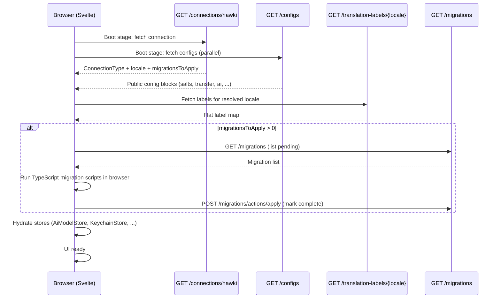

# Connections

The connection bootstrap is the first JSON:API call the Svelte frontend makes after the browser loads HAWKI. It bundles everything the frontend needs to initialise: the current user identity, locale, migration count, WebSocket config, crypto salts, and all public config blocks — in one round trip.

**Key classes:** `ConnectionFactory`, `ConnectionRepository`, `ConnectionSchema`, `ConnectionType`, `UserContext`, `UsageContext`.

---

## The `/connections/hawki` Endpoint

```
GET /api/hawki/v1/connections/hawki
```

No query parameters or request body. Response is a standard JSON:API resource document with `type: "connections"` and `id: "hawki"`.

`ConnectionFactory::createHawkiConnection()` assembles the payload. It reads from:

- `LocaleService` — current locale
- `FrontendMigrationRepository` — count of pending migrations for this user
- `SaltConfig` — five named crypto salts (delivered only to authenticated users)
- `request()->user()` — user identity (when authenticated)
- `UserContext` — determines the connection type

`ConnectionSchema` sets `authorizable(): false` because `ConnectionFactory` itself enforces access control by inspecting `UserContext` and `UsageContext`. A second authorization layer on the schema would be redundant.

---

## ConnectionType Enum

`ConnectionType` (`app/Services/Frontend/Connection/Values/ConnectionType.php`) describes both the origin (native HAWKI vs. external app) and the authentication state of the current session. The frontend uses it to decide which UI flows and API calls are available.

| Value                        | Raw string                     | Meaning                                                                  |
|------------------------------|--------------------------------|--------------------------------------------------------------------------|
| `INTERNAL`                   | `'internal'`                   | Native HAWKI session, not authenticated (guest view)                     |
| `INTERNAL_REGISTERING_USER`  | `'internal_registering_user'`  | User is partway through first-login registration; key generation pending |
| `INTERNAL_AUTHENTICATED`     | `'internal_authenticated'`     | Normal logged-in user                                                    |
| `EXTERNAL_APP`               | `'external_app'`               | External app connection before a HAWKI user account is linked            |
| `EXTERNAL_APP_AUTHENTICATED` | `'external_app_authenticated'` | External app connection with a linked, authenticated HAWKI user          |

The TypeScript side (`resources/js/data/connection/connection.ts`) exposes narrowing functions for each value:

| ConnectionType value         | Frontend narrowing function                                     |
|------------------------------|-----------------------------------------------------------------|
| `INTERNAL`                   | `getConnection()` — no dedicated narrowing                      |
| `INTERNAL_REGISTERING_USER`  | `getRegisteringUserConnection()`, `getConnectionWithUserInfo()` |
| `INTERNAL_AUTHENTICATED`     | `getAuthenticatedConnection()`, `getConnectionWithUserInfo()`   |
| `EXTERNAL_APP`               | `getConnection()` — no dedicated narrowing                      |
| `EXTERNAL_APP_AUTHENTICATED` | `getConnection()` — no dedicated narrowing                      |

:::warning[Do not confuse ConnectionType with WellKnownUserTypes]
`ConnectionType` is a `string`-backed PHP enum with five cases describing the frontend session.
`WellKnownUserTypes` is an interface with string constants (`GUEST`, `REGISTERING_USER`, `USER`, `EXTERNAL_APP`) held by `UserContext` to describe who is making the current backend request.
They overlap conceptually but are separate classes and serve different layers. There is no `GUEST` case in `ConnectionType`.
:::

---

## UserContext and UsageContext

These two request-scoped singletons are populated by middleware (`SystemContextBootingMiddleware`) before any controller sees the request. Every service that needs to know about the current caller injects them via constructor.

### UserContext

`UserContext` (`app/Services/System/UserTypes/UserContext.php`) answers **WHO** is calling:

| `WellKnownUserTypes` constant | Meaning                                                                  |
|-------------------------------|--------------------------------------------------------------------------|
| `GUEST`                       | Unauthenticated visitor (default)                                        |
| `REGISTERING_USER`            | Mid-registration; partial user data available via `getRegisteringUser()` |
| `USER`                        | Fully authenticated HAWKI user                                           |
| `EXTERNAL_APP`                | External app credential, before a real user is resolved                  |

Any call to `UserContext::set()` that changes the type immediately dispatches `UserTypeChangedEvent` so listeners can react synchronously (for example, middleware that locks the keychain after logout).

### UsageContext

`UsageContext` (`app/Services/System/UsageTypes/UsageContext.php`) answers **WHAT surface** the request comes from:

| `WellKnownUsageTypes` constant | Value        | Meaning                                    |
|--------------------------------|--------------|--------------------------------------------|
| `MAIN_APP`                     | `'main'`     | Standard HAWKI browser interface (default) |
| `EXTERNAL_APP`                 | `'external'` | External application integration           |

Contextual scopes and AI dispatch read `UsageContext` to apply the right filtering (for example, only exposing models enabled for the external-app usage type to external callers).

:::caution[Tests]
Both singletons are request-scoped. Never resolve them in a test without explicit setup. See [Custom Infrastructure Patterns](./100-Architecture/250-Custom-Infrastructure.md) for the testing patterns.
:::

---

## What the Frontend Receives: `hawki-core` Config Blocks

Beyond the connection resource itself, the `configs` resource assembles all public config blocks from `PublicConfigRegistry`. The blocks relevant to the initial frontend boot are:

| Public key      | Source class        | Delivered to                                                           |
|-----------------|---------------------|------------------------------------------------------------------------|
| `locale`        | `LocaleConfig`      | All visitors (default locale, available locales)                       |
| `salts`         | `SaltConfig`        | Authenticated users + registering users (subset)                       |
| `security`      | `SecurityConfig`    | All visitors (passkey UX settings)                                     |
| `transfer`      | `TransferConfig`    | All visitors (base URL); WebSocket details only to authenticated users |
| `ai`            | `AiConfig`          | Authenticated users (AI handle, AI user display name and avatar)       |
| `storage_files` | `FileStorageConfig` | Authenticated users (MIME allowlist, max file size)                    |

### WebSocket Config

`WebsocketTransferConfig` is embedded inside the `transfer` config block and is the **only** source of Reverb connection parameters the frontend reads. Misconfiguring it (`REVERB_HOST`, `REVERB_PORT`, `REVERB_SCHEME`) is the most common cause of a broken WebSocket connection after deployment. The frontend's `dependencyLoader('echo')` reads exclusively from this config block — not from any `.env` variable directly accessible to the browser.

---

## Session-Based Registration and Handshake (Parallel Path)

The JSON:API layer is not the only path through authentication. The legacy `/register` and `/handshake` Blade routes still exist for browser-based logins:

1. The user fills in credentials on the login form.
2. The auth middleware calls `ChainedAuthService::authenticate()`. On a first-ever login, no local user record exists yet.
3. `UserContext` is set to `REGISTERING_USER`. The connection bootstrap reports `INTERNAL_REGISTERING_USER` to the frontend.
4. The frontend redirects to the `/handshake` Blade view, which runs the client-side key-generation flow (creating the user's asymmetric keypair, deriving the passkey, uploading the public key).
5. After the handshake completes, the user is fully created and subsequent logins proceed to `INTERNAL_AUTHENTICATED`.

Junior developers browsing `routes/web.php` will see these routes and find them confusing if the docs only cover the JSON:API path. Both paths coexist: the JSON:API layer handles ongoing data access; the Blade handshake handles the one-time registration ceremony.

:::caution[AI user identity is immutable]
The system AI user (user ID 1) — HAWKI's own AI assistant — has its display name, username, and avatar set by `config/hawki.php` `migration` values at database migration time. These values are baked into the DB during the initial `migrate` run and **cannot be changed afterward** without a manual DB update. The `hawki:update-avatar` artisan command can update the avatar from a local file path after the fact.
:::

---

## Frontend Boot Sequence

The following diagram shows the sequence of HTTP calls the Svelte frontend makes on every page load after login, and how they depend on each other:



The connection resource and the configs resource are fetched in parallel during the first boot stage. Translation labels are fetched next using the locale identifier from the connection payload. Only after labels are loaded does the frontend check `migrationsToApply` — if pending migrations exist, they run before the UI becomes interactive.

---

## External App Connections

External applications connect through a parallel path on the same endpoint, using the external user's ID as the resource ID:

```
GET /api/hawki/v1/connections/{extAppUserId}
```

`ConnectionFactory::createExtAppConnection()` handles this path. It looks up the `ExtApp` record associated with the authenticated app credential, then checks whether the external user ID is already linked to a HAWKI account:

- Linked → `EXTERNAL_APP_AUTHENTICATED` + `ExtAppSecrets` (passkey, API token, private key for the HAWKI account)
- Not yet linked → `EXTERNAL_APP` + an encrypted `extAppConnectRequest` payload that the external app uses to initiate the linking flow

The `UsageContext` must be `EXTERNAL_APP` and `UserContext` must be `EXTERNAL_APP` for this path to succeed; otherwise `ConnectionFactory` logs a warning and returns `null`.

See [External App Integration](./800-Encryption-and-Security/200-External-Apps.md) for the full ext-app flow.
