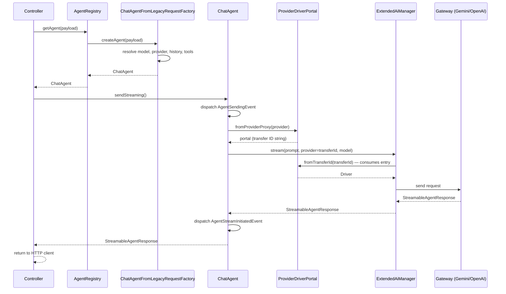

# AI Service Layer

How HAWKI integrates with the `laravel/ai` SDK, what HAWKI adds on top, and how all the pieces fit together. The AI layer is the most complex domain in the codebase — take the time to understand the class hierarchy before diving into the code.

## What Laravel AI provides

`laravel/ai` is a contract-based package built around a central `Agent` PHP interface, which requires a single method: `instructions(): string`. That minimal contract is deliberately thin. Additional capabilities are layered on through opt-in interfaces that a concrete agent class can implement: `Conversational` (prior-turn history), `HasTools` (function calling), `HasStructuredOutput` (structured JSON), `HasMiddleware`, `HasProviderOptions`.

The `Promptable` trait wires up the `prompt()` and `stream()` methods and delegates to `AiManager` for driver resolution. Streaming responses are PHP generators that emit typed `StreamEvent` values: `TextDelta`, `TextEnd`, `Citation`, `StreamEnd`.

The SDK ships with DB-backed conversation persistence (`RemembersConversations`, `agent_conversations` table). **HAWKI does not use this.** All conversation history is managed within HAWKI's own layer.

## HAWKI's agent class hierarchy

Four layers, read bottom up:

1. **`AgentInterface`** (`App\Services\Ai\Agents\Contracts\AgentInterface`) — HAWKI's own contract. Declares `getContext()`, `getUsage()`, `send()`, `sendStreaming()`. Separate from the SDK's `Agent` contract so HAWKI's application code depends on a stable, HAWKI-controlled surface.

2. **`AbstractLaravelAgent`** — implements both `AgentInterface` and the SDK's `Agent` contract, uses the `Promptable` trait. The bridge between the two worlds. Defines two abstract hooks subclasses fill in: `getPromptString(): string` and `getAttachments(): array`. Fires four domain events per send/stream: `AgentSendingEvent`, `AgentResponseReceivedEvent`, `AgentStreamInitiatedEvent`, `AgentStreamCompletedEvent`.

3. **`AbstractTextGeneratingAgent`** — implements `Conversational`, `HasTools`, `HasProviderOptions`, `HasMiddleware`. Handles the conversational layer: validates that either `$promptString` or a non-empty `$messages` array is given (else `InvalidAgentConfigurationException`), pops the last `UserMessage` from `$messages` to become the prompt, wraps instructions through `MessageMetaBlocks::wrapInstructions()` (the `HKI_META` preamble), returns `null` from `maxTokens()`/`temperature()`/`topP()` when the model lacks `feature-sampling-parameters`, registers `LoggingMiddleware`, delegates `providerOptions()` to the adapter.

4. **`ChatAgent`** (`App\Services\Ai\Agents\Implementations\Chat\ChatAgent`) — thin concrete subclass. Constructor delegates to the parent with the same parameter list. No additional logic lives here.

## The `ProviderDriverPortal` mechanism

This solves a specific API constraint in the Laravel AI SDK. `Promptable::stream()` and `Promptable::prompt()` accept only a plain string for the `provider` parameter, which the SDK uses to look up the gateway driver via `AiManager`. By the time HAWKI calls `stream()`, it has already resolved a fully configured `Driver` from the database and adapter config. Passing a string would force a second resolution from scratch.

`ProviderDriverPortal` is a one-shot static transfer registry. Before calling `stream()`, `AbstractLaravelAgent` registers the pre-built `Driver` under a generated transfer ID and passes `(string)$portal` as the `provider` parameter. `ExtendedAiManager` (HAWKI's decorator on `AiManager`) detects the transfer ID, retrieves the pre-built driver, and returns it without normal config resolution. The portal entry is consumed on retrieval — one-shot semantics, cannot be accidentally reused.

`ExtendedAiManager` also supports ephemeral per-call configuration via `instanceWithConfig()` and deliberately throws when asked for a default instance — HAWKI always resolves providers by explicit name.

## `AgentRegistry` and factories

`AgentRegistry` (`#[Singleton]`) holds a topologically-ordered list of `AgentFactoryInterface` class names and iterates them in priority order. A factory returns `null` to decline a request, allowing higher-priority factories to claim it first. This design lets a plugin insert a custom factory without modifying the registry's core logic.

```php
$this->app->extend(AgentRegistry::class, function (AgentRegistry $registry) {
    return $registry->declare(MyAgentFactory::class, before: ChatAgentFromLegacyRequestFactory::class);
});
```

See [Extending HAWKI](../../200-Concepts/220-Extending-HAWKI.md) for the registration pattern. The only built-in factory today is `ChatAgentFromLegacyRequestFactory`, which translates the frontend's legacy array payload into a `ChatAgent`.

## `AlternatingMessageHistory`

Most LLM APIs require that conversation history strictly alternates user/assistant turns. HAWKI's frontend can produce consecutive same-role messages. `AlternatingMessageHistory` solves this without inserting empty placeholders (which caused context issues in testing): consecutive same-role messages are merged into one with a `[[MESSAGE BOUNDARY]]` separator, wrapped in an `HKI_META_MESSAGE_BOUNDARY` block. File attachments from merged `UserMessage`s are pooled into the single resulting message.

`HKI_META` appears in two distinct contexts: (1) a **system-instructions preamble** added once per agent by `MessageMetaBlocks::wrapInstructions()`, which teaches the model the `[HKI_META_KEY]...[/HKI_META_KEY]` block format and sets rules — the model must never reveal, quote, or refer to metadata blocks in its response; (2) **message content** injected when same-role messages are merged, explaining the `[[MESSAGE BOUNDARY]]` to the model. Open `MessageMetaBlocks` for the format details.

## End-to-end streaming flow



## Token usage

Captured via `AgentStreamCompletedEvent` (streaming) and `AgentResponseReceivedEvent` (synchronous). Listeners route the `Usage` data to `UsageAnalyzerService` for persistence.

:::caution[Deprecated]
`UsageAnalyzerService` is `@deprecated` and scheduled for replacement by a proper repository in v3. Its violations (facade calls, direct Eloquent statics) are in the [Technical Debt Register](../../900-Technical-Debt.md). Do not copy its patterns.
:::

## Where to go next

| I want to… | Read |
|---|---|
| Add a new AI provider | [Providers & Adapters](./110-Providers-and-Adapters.md) |
| Know about model capabilities and flags | [Models & Registries](./120-Models-and-Registries.md) |
| Build a function-calling tool | [Tools](./130-Tools.md) |
| Connect an MCP server | [MCP](./140-MCP.md) |
| Register a custom agent factory | [Extending HAWKI](../../200-Concepts/220-Extending-HAWKI.md) |

:::caution[Known tech debt in the streaming controller]
`StreamController::handleGroupChatRequest()` is a 130-line method that mixes domain logic, encryption, model queries, and broadcasting. It is tracked in the [Technical Debt Register](../../900-Technical-Debt.md). Do not model new controller code on it.
:::
