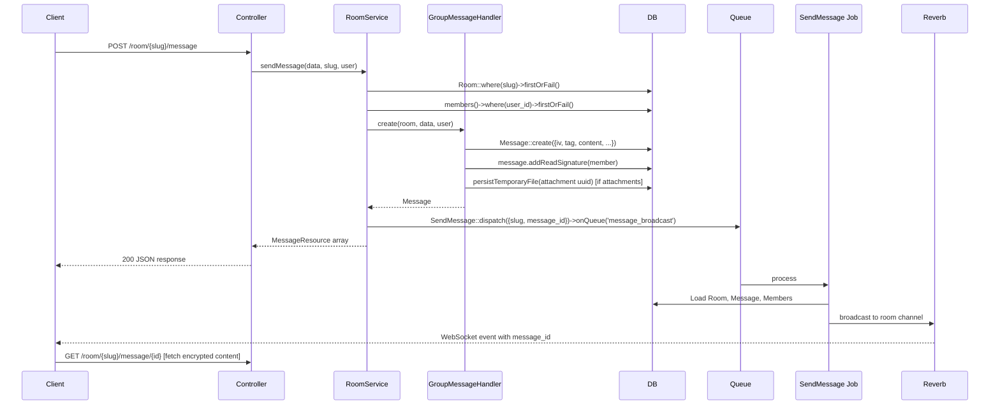

# Messages

The full lifecycle of a message in a group room: how a message record is created, how it reaches room members over WebSocket, and how the AI response is produced and streamed back.

:::note
This page covers group room messages. Private AI conversation messages (`AiConvMsg`) are in [Private Conversations](./230-Private-Conversations.md).
:::

## The `Message` model

`App\Models\Message` stores group room messages. Content is always stored encrypted — the server never holds plaintext message content. The three fields `iv`, `tag`, and `content` together form an AES-256-GCM ciphertext (see [Encryption](../400-Encryption/410-Encryption.md)). The room's symmetric key — held only by the client — is used for both encryption and decryption. The server stores and relays the ciphertext without ever being able to read it.

This means search, moderation, and any server-side content analysis are impossible by design for room messages.

For the full field list, open the `Message` class. The load-bearing concepts:

- **`message_id`** is a decimal string encoding the thread position. Top-level messages get whole-number IDs (`1.000`, `2.000`, `3.000`); thread replies under message `2` get sub-IDs (`2.001`, `2.002`, …). `AbstractMessageHandler::assignID()` computes the next ID.
- **`has_thread`** on the parent is flipped to `true` by an event listener when the first reply is created. Lets the frontend show a "show thread" button without loading the thread eagerly.
- **`reader_signs`** is a JSON array of member IDs. `Message::addReadSignature($member)` appends the member's ID if not already present and dispatches `MessageUpdatedEvent`. The frontend shows a per-member "read" indicator driven by this field.
- **`metadata`** is a JSON object written by the message handler: `{ tools: [...], params: {...} }`. `getTools()` and `getParameters()` are convenience accessors.

## Message send flow

**Why is the message created before the WebSocket broadcast?** The `SendMessage` job is dispatched to the `message_broadcast` queue only after `GroupMessageHandler::create()` returns. The job fetches the message from DB and broadcasts its `message_id` (not the content). The client receives the ID and fetches the encrypted content in a separate request. The content never travels over WebSocket — only the notification that a message exists.

**Why return the response immediately and broadcast asynchronously?** The HTTP response goes back to the sender with the newly created message data. The WebSocket broadcast happens via a queued job so the HTTP request doesn't block on WebSocket delivery. Other room members receive the push event; the sender already has the data from the HTTP response.

## The AI response path

The AI is always room member 1 (the user with `id = 1`, configured in `config/hawki.php` and set at DB migration time — it cannot be changed afterward). When a user sends a message that should trigger an AI response, a separate flow runs:

1. `StreamController::handleGroupChatRequest()` receives the streaming request.
2. It resolves the `AgentRegistry`, retrieves an agent for the request payload, and calls `$agent->sendStreaming()`.
3. Before streaming starts, the AI's response message record is written to the DB via `GroupMessageHandler::create()` with `message_role = 'assistant'`.
4. As streaming chunks arrive, they are sent to the client over the HTTP connection (server-sent events).
5. When streaming completes, `GroupMessageHandler::update()` writes the final encrypted content back into the already-existing message record.

**Why write the message record before streaming completes?** Other room members need to know an AI response is in progress. The empty-but-existing record (with `message_role = 'assistant'`) triggers `RoomAiWritingStartedEvent` and `RoomAiWritingEndedEvent` so the frontend can show a "typing" indicator before the full response arrives.

:::caution[Known tech debt]
`StreamController::handleGroupChatRequest()` is a 130-line method that mixes domain logic, encryption, model queries, and broadcasting. See [Technical Debt](../../900-Technical-Debt.md). Do not model new controller code on it.
:::

## `GroupMessageHandler`

`App\Services\Chat\Message\Handlers\GroupMessageHandler` handles the lifecycle of group room messages. It extends `AbstractMessageHandler`, which provides `assignID()` for computing the next decimal message ID.

- `create(Room $conv, array $data, User $user): Message` — creates the DB record, resolves attachment identifiers from temporary to permanent storage, adds the sender's read signature, dispatches `MessageSentEvent`.
- `update(Room $conv, array $data): Message` — updates content (encrypted payload), metadata, and model fields; dispatches `MessageUpdatedEvent`.
- `delete(Room $conv, array $data): bool` — deletes attachments and the message record.

## Events

- `MessageSentEvent` — after `GroupMessageHandler::create()` succeeds
- `MessageUpdatedEvent` — after `GroupMessageHandler::update()` or `Message::addReadSignature()`
- `RoomAiWritingStartedEvent` — when the AI starts generating a response
- `RoomAiWritingEndedEvent` — when AI streaming completes or fails

All extend `AbstractMessageEvent` or `AbstractRoomAiWritingEvent` and live in `app/Services/Chat/Events/`. See [Events & Listeners](../../200-Concepts/170-Events-and-Listeners.md).

## File attachments

File attachments follow a two-step upload flow:

1. The client uploads the file to `/upload`. The backend calls `FileStorageService::storeTemporary()` with `StoredFileCategory::GROUP`. The returned UUID is sent back to the client.
2. When the message is sent, the client includes the UUID list in the message payload. `GroupMessageHandler::create()` calls `FileStorageService::persistTemporaryFile()` for each UUID, moving the file from `temp/` to permanent storage, then creates an `Attachment` record via `AttachmentRepository::assignToMessage()`.

If the message is never sent, the temporary file is cleaned up by the `filestorage:cleanup` artisan command (removes files older than 5 minutes from `temp/`). See [Storage & Files](../300-Storage/310-Storage-and-Files.md).

Attachment access is always proxied through `StorageProxyController`, which checks room membership before serving `GROUP` category files.
