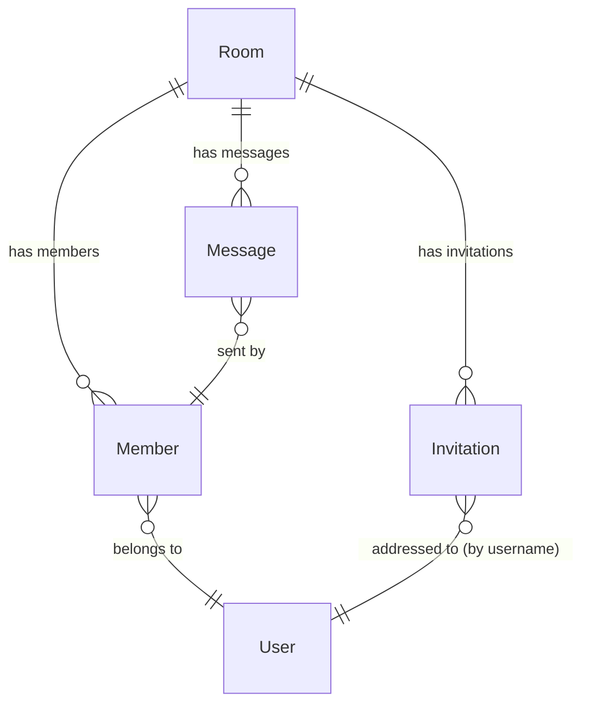

# Chat & Rooms

The chat domain handles two distinct conversation modes — group rooms shared by multiple users and private one-to-one AI conversations — along with membership, invitations, message encryption, threading, file attachments, and real-time WebSocket delivery.

This page covers the group room side. Private AI conversations are in [Private Conversations](./230-Private-Conversations.md); message lifecycle is in [Messages](./220-Messages.md).

## The two conversation types

| Feature | Group Room (`Room`) | Private AI Conversation (`AiConv`) |
|---|---|---|
| Participants | Multiple members (admin / editor / viewer / assistant) | Owner only |
| Encryption | Room key distributed per member via keychain | No room key — server enforces ownership |
| Invitations | `Invitation` model, encrypted invite data | None |
| File category | `StoredFileCategory::GROUP` | `StoredFileCategory::PRIVATE` |
| Read receipts | Yes (`reader_signs`) | No |
| Threading | Yes (`thread_id` / `has_thread`) | Yes (`message_id`) |
| Auto-delete | When only one member remains | When user deletes the conversation |

## Entity relationships



## The `Room` model

`App\Models\Room` is identified by a URL-safe slug generated on creation by combining a slugified room name with six random characters (e.g. `my-project-a1b2c3`). The slug is stable for the lifetime of the room. The model uses `HasContextualScopesTrait` and registers `RoomAccessScope` — when a non-CLI request is active, every `Room` query is automatically filtered to only rooms the current user is a member of. See [Contextual Scopes](../../200-Concepts/140-Contextual-Scopes.md).

Auto-deletion: when `removeMember()` drops the member count to exactly 1 (the AI assistant is always member 1), the room deletes itself. If the last removed member was an admin and no other admins remain, the room also deletes immediately. This cleanup logic currently lives directly in the `Room` model — it is a known tech-debt item (see [Technical Debt](../../900-Technical-Debt.md)).

## The `Member` model

`App\Models\Member` represents a single user's membership in a room. Members are never hard-deleted: `revokeMembership()` sets `isRemoved = 1` (soft-removal preserves history and allows the same user to rejoin via `recreateMembership()`).

Roles: `admin` (creator, full control including kicking others), `editor` (standard human member), `viewer` (read-only human member), `assistant` (always user 1, the AI agent). Open the `Member` class for the canonical role constants.

The `last_read` timestamp (updated by `updateLastRead()`) drives the unread-message indicator on the frontend.

## Deferred member events

Bulk operations — creating a room with 20 invited members, re-joining a room after an invitation is accepted — must not fire events for each individual member while the overall state is still in flux. `Room::runWithDeferredMemberEvents(callable)` collects member events into a local array rather than dispatching them immediately. The callback runs normally; calls to `addMember()` / `removeMember()` inside it queue a closure. After the callback returns, the method hands back a callable the caller invokes once the outer transaction is fully committed:

```php
$deferred = $room->runWithDeferredMemberEvents(function () use ($room) {
    $room->addMember(1, Member::ROLE_ASSISTANT);
    $room->addMember(Auth::id(), Member::ROLE_ADMIN);
});

RoomCreatedEvent::dispatch($room);
$deferred(); // NOW fire MemberAddedToRoomEvent x2
```

Without this pattern, `MemberAddedToRoomEvent` would fire for the AI agent before the human admin member exists, and listeners building an audience list would produce an incomplete result.

## The invitation flow

When a room admin invites a user who does not yet have a room key, an `Invitation` record is created. The invitation stores the encrypted room key material for the invitee — the server never sees the plaintext key. The `Invitation` → `User` relationship uses `username` as the join key (not `id`), so invitations remain valid even if the invitee's user record is created after the invitation.

`Invitation` dispatches `InvitationCreatedEvent` on `created` and `InvitationUpdatedEvent` on `updated` via `$dispatchesEvents`. The `room-members` JSON:API resource combines `Member` and `Invitation` records into a unified response — a pending invitation appears as a "member" with a pending state on the frontend.

## `RoomService` structure

`App\Services\Chat\Room\RoomService` is the public service entry point for room operations. It is injected with a `GroupMessageHandler` via the container.

:::warning Known pre-refactor rough edge
`RoomService` uses PHP traits (`RoomFunctions`, `RoomMembers`, `RoomMessages`) to split its implementation across files. The HAWKI contributing guide explicitly labels this pattern as the `// ❌ Bad` approach for service decomposition — the correct pattern is sub-services via `public readonly` constructor properties (see [Layers & Domains](../../200-Concepts/100-Layers-and-Domains.md)). The traits also call `Auth::id()`, `Auth::user()`, `Log::error()`, and `app(AvatarStorageService::class)` directly — all of which violate the no-facades-in-services and no-`app()`-helpers rules.

Do not copy this structure in new code. See [Technical Debt](../../900-Technical-Debt.md).
:::

## `RoomAccessScope`

Registered as a contextual scope on the `Room` model under the key `'access'`. When active in a request context, it adds a `whereHas('members', ...)` constraint restricting results to rooms where the current user is a member. Bypassable for specific queries via the sandboxed scope API (see [Contextual Scopes](../../200-Concepts/140-Contextual-Scopes.md)) — the mechanism admin commands use to iterate over all rooms without the membership filter.

## System prompt providers

Every room can carry a custom `system_prompt`. `SystemPromptProvider` resolves the appropriate prompt by checking, in priority order: the room's own `system_prompt` field (if set), then the system-level default prompt for the current locale. Prompts are typed (`DEFAULT`, `SUMMARY`, `IMPROVEMENT`, `NAME`) and locale-aware via the contextual scope system on the `SystemPrompt` model. Room-level overrides always win.

## See also

| I want to… | Read |
|---|---|
| Understand message lifecycle and the streaming AI response | [Messages](./220-Messages.md) |
| Understand private AI conversations | [Private Conversations](./230-Private-Conversations.md) |
| Understand how room key encryption works | [Encryption](../400-Encryption/410-Encryption.md) |
| Understand how file attachments are stored and served | [Storage & Files](../300-Storage/310-Storage-and-Files.md) |
