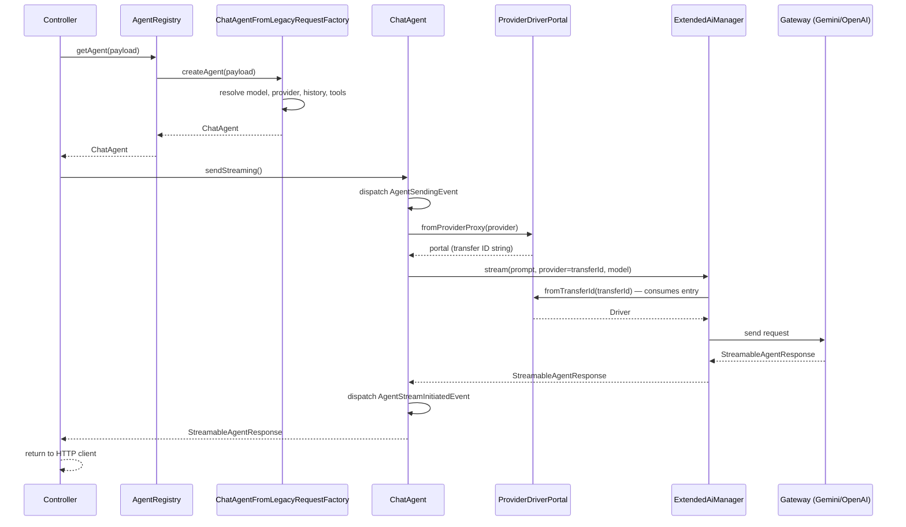

# AI Service Layer Overview

This article explains how HAWKI integrates with the `laravel/ai` SDK, what HAWKI adds on top, and how all the pieces fit together end to end. The AI layer is the most complex domain in the codebase — take the time to understand the class hierarchy before diving into the code.

## What Laravel AI Provides

`laravel/ai` is a contract-based package built around a central `Agent` PHP interface, which requires a single method: `instructions(): string`. That minimal contract is deliberately thin. Additional capabilities are layered on through opt-in interfaces that a concrete agent class can implement:

| Interface | What it adds |
|---|---|
| `Conversational` | Prior-turn history via `messages()` |
| `HasTools` | Tool bindings for function calling |
| `HasStructuredOutput` | Structured JSON output via a schema |
| `HasMiddleware` | Middleware pipeline around each request |
| `HasProviderOptions` | Provider-specific driver options per call |

The `Promptable` trait wires up the `prompt()` and `stream()` methods and delegates to `AiManager` for driver resolution. `AiManager` abstracts over gateway classes (OpenAI, Anthropic, Gemini, etc.) identified by a `Lab` enum.

Streaming responses are PHP generators that emit typed `StreamEvent` values in sequence: `TextDelta`, `TextEnd`, `Citation`, and `StreamEnd`. Consumers iterate the generator to process each event as it arrives.

The SDK ships with DB-backed conversation persistence (`RemembersConversations`, `agent_conversations` table). **HAWKI does not use this.** All conversation history is managed entirely within HAWKI's own layer.

## HAWKI's Agent Class Hierarchy

HAWKI builds four layers on top of the SDK. Understanding them from bottom up is the key to reading the AI code.

### Layer 1: `AgentInterface` — HAWKI's Own Contract

`App\Services\Ai\Agents\Contracts\AgentInterface` is HAWKI's internal contract for agents. It declares four methods:

```php
interface AgentInterface
{
    public function getContext(): AgentRequestContext;
    public function getUsage(): TokenUsage;
    public function send(): AgentResponse;
    public function sendStreaming(): StreamableAgentResponse;
}
```

Every HAWKI agent must implement this interface. It is separate from Laravel AI's `Agent` contract so that HAWKI's application code can depend on a stable, HAWKI-controlled surface rather than directly on the SDK's API.

### Layer 2: `AbstractLaravelAgent` — Bridging HAWKI and Laravel AI

`App\Services\Ai\Agents\Adapters\AbstractLaravelAgent` implements both `AgentInterface` and Laravel AI's `Agent` contract, and uses the `Promptable` trait from the SDK. This class is the bridge between the two worlds.

It defines two protected abstract hook methods that subclasses fill in:

- `getPromptString(): string` — the user-turn text to send to the model.
- `getAttachments(): array` — file attachments for the prompt (defaults to `[]`).

**Domain events.** Every send or stream call fires four domain events so listeners can react without coupling to the agent implementation:

| Event | When it fires |
|---|---|
| `AgentSendingEvent` | Before any HTTP call is made (both `send` and `sendStreaming`) |
| `AgentResponseReceivedEvent` | After a synchronous response is received |
| `AgentStreamInitiatedEvent` | After the stream object is created, before data flows |
| `AgentStreamCompletedEvent` | When the stream closes and final token usage is known |

**Token usage.** `getUsage()` returns a `TokenUsage` object wrapping the SDK's `Usage` data. Calling it before `send()` completes or before the stream has been fully consumed throws an `AgentStateException`.

**The `ProviderDriverPortal` mechanism.** This is the most important design detail in `AbstractLaravelAgent`. See the dedicated section below.

### Layer 3: `AbstractTextGeneratingAgent` — The Conversational Layer

`App\Services\Ai\Agents\Adapters\AbstractTextGeneratingAgent` extends `AbstractLaravelAgent` and implements the full set of Laravel AI contracts needed for a conversational, tool-capable agent: `Conversational`, `HasTools`, `HasProviderOptions`, and `HasMiddleware`.

Its constructor accepts:

```php
public function __construct(
    protected AgentRequestContext $context,
    protected string              $instructions,
    protected array               $messages = [],
    protected iterable|null       $tools = null,
    protected string|null         $promptString = null,
    protected array|null          $attachments = null,
)
```

**Validation.** The constructor validates that either `$promptString` or a non-empty `$messages` array is provided. If neither is given, it throws `InvalidAgentConfigurationException`.

**Popping the last message.** When `$messages` is used (the typical path from the factory), the constructor pops the last entry from the array. That last entry must be a `UserMessage` with non-empty content — it becomes the prompt string. All earlier messages become the conversation history returned by `messages()`. File attachments from the popped message are carried forward unless the caller supplied `$attachments` explicitly.

**HKI_META preamble.** The `instructions()` method wraps the raw system instructions through `MessageMetaBlocks::wrapInstructions()`, which prepends a preamble explaining the `HKI_META` block format to the model. See the `AlternatingMessageHistory` section below for details.

**Sampling parameters.** `maxTokens()`, `temperature()`, and `topP()` return `null` when the model's flags indicate it does not support sampling parameters (`hasFeatureSamplingParameters()` returns false). This lets the provider apply its own defaults rather than HAWKI overriding them with meaningless values.

**Middleware.** `middleware()` registers `LoggingMiddleware`, which logs the provider name, model ID, agent class, the authenticated user's ID, token counts, and whether the call was streaming. This fires on every request.

**Provider options.** `providerOptions()` delegates to `$context->provider->adapter->getAdditionalDriverOptions()`, so any adapter-specific options (e.g. extended thinking on Anthropic) are injected without the agent knowing about provider specifics.

### Layer 4: `ChatAgent` — The Concrete Implementation

`App\Services\Ai\Agents\Implementations\Chat\ChatAgent` is a thin subclass of `AbstractTextGeneratingAgent`. Its constructor simply delegates to the parent with the same parameter list. No additional logic lives here — all behaviour is in the abstract layers.

```php
class ChatAgent extends AbstractTextGeneratingAgent
{
    public function __construct(
        AgentRequestContext $context,
        string              $instructions,
        array               $messages,
        iterable            $tools,
        string|null         $promptString = null,
        array|null          $attachments = null
    ) {
        parent::__construct(...);
    }
}
```

## The `ProviderDriverPortal` Mechanism

This mechanism solves a specific API constraint in the Laravel AI SDK and is critical to understand before reading `AbstractLaravelAgent`.

**The problem.** `Promptable::stream()` and `Promptable::prompt()` accept only a plain string for the `provider` parameter. Laravel AI uses that string to look up the gateway driver via `AiManager`. But by the time HAWKI calls `stream()`, it has already resolved a fully configured `Driver` instance from the database and adapter config. Passing a string would force a second resolution from scratch, losing the DB-bound settings and wasting round trips.

**The solution.** `ProviderDriverPortal` is a one-shot static transfer registry. Before calling `stream()`, `AbstractLaravelAgent` calls `ProviderDriverPortal::fromProviderProxy($context->provider)`, which registers the pre-built `Driver` under a generated transfer ID string and returns the portal. The portal's `__toString()` returns that transfer ID. `AbstractLaravelAgent` then passes `(string)$portal` as the `provider` parameter to `stream()`.

`ExtendedAiManager` (HAWKI's decorator on Laravel AI's `AiManager`) overrides `instance()`. When it receives a string that matches an active transfer ID, it retrieves the pre-built driver from the portal and returns it immediately — without going through normal config resolution. The portal entry is consumed on retrieval (one-shot semantics), so it cannot be accidentally reused.

```php
// Inside AbstractLaravelAgent::sendStreaming()
$response = $this->stream(
    prompt: $this->getPromptString(),
    attachments: $this->getAttachments(),
    provider: (string)ProviderDriverPortal::fromProviderProxy($this->getContext()->provider),
    model: $this->getContext()->model->model_id
);
```

**`ExtendedAiManager`** also supports ephemeral per-call configuration via `instanceWithConfig()`, and deliberately throws when asked for a default instance — because HAWKI always resolves providers by explicit name and there is no meaningful global default.

## `AgentRegistry` and `AgentFactoryInterface`

`AgentRegistry` (`#[Singleton]`) is the entry point for all agent creation. It holds a topologically-ordered list of `AgentFactoryInterface` class names and iterates them in priority order when asked to resolve an agent.

`AgentFactoryInterface` has a single method:

```php
public function createAgent(mixed $request): AgentInterface|null;
```

A factory returns `null` to decline a request, allowing higher-priority factories to claim it first. This design means you can insert a custom factory without modifying the registry's core logic.

**Registration.** Factories are declared via `$app->extend()` in a service provider:

```php
$this->app->extend(
    AgentRegistry::class,
    fn(AgentRegistry $registry) => $registry
        ->declare(MyAgentFactory::class, before: ChatAgentFromLegacyRequestFactory::class)
);
```

The `before:` and `after:` parameters are the mechanism for plugins to insert new agent types at a specific position in the priority list without touching core code.

**`AbstractAgentFactory`** is the base class for all `AgentFactoryInterface` implementations. It provides the shared `createRequestContext(AiModel, ?AiModelParameters, ?AiProvider, ?string): AgentRequestContext` helper, which assembles the fully-resolved `AgentRequestContext` from a model and optional overrides. The three cross-cutting services it needs (tool resolver, provider-proxy resolver, usage context) are injected via setter methods called by the container's `afterResolving` hook.

**Currently registered factory:** `ChatAgentFromLegacyRequestFactory` — the only factory in HAWKI core. It translates the frontend's legacy array payload into a `ChatAgent`. It returns `null` for any request that does not have the expected `payload.messages` array and `payload.model` string shape.

:::info[Extension point]
`AgentRegistry::declare()` is a live extension point today. Registering a new factory with `before:` lets a plugin insert a custom agent type that takes priority over the built-in chat flow. See [Plugin System Preview](../1000-Infrastructure/100-Plugin-System-Preview.md) for the full plugin picture.
:::

## `AlternatingMessageHistory`

Most LLM APIs require that the conversation history strictly alternates between user and assistant turns. HAWKI's frontend can produce consecutive same-role messages — for example a user sending two messages in a row before the AI responds, or an assistant producing two consecutive responses.

`AlternatingMessageHistory` solves this without inserting empty placeholder messages (which caused context issues in testing). Instead, consecutive messages with the same role are merged into a single message with a `[[MESSAGE BOUNDARY]]` separator between them.

**How it works:**

```php
$history = new AlternatingMessageHistory();
$history->registerUserMessage('First question', $attachments);
$history->registerUserMessage('Second question');
$history->registerAiMessage('Answer to both');

// Produces: [UserMessage(merged), Message(assistant)]
$messages = $history->toArray();
```

**Two distinct `HKI_META` usages.** It is important to understand that `HKI_META` appears in two different contexts:

1. **System instructions preamble.** `MessageMetaBlocks::wrapInstructions()` prepends a preamble to the system instruction string (called once per agent instance). This preamble teaches the model the `[HKI_META_KEY]...[/HKI_META_KEY]` block format and sets rules: the model must never reveal, quote, or refer to metadata blocks in its response. This runs in `AbstractTextGeneratingAgent::instructions()`.

2. **Message content.** When two same-role messages are actually merged, the merged content contains a local `HKI_META` block explaining the boundary:

   ```
   [HKI_META_MESSAGE_BOUNDARY]
   Multiple messages have been merged into one. The messages are separated by the following boundary: [[MESSAGE BOUNDARY]]
   [/HKI_META_MESSAGE_BOUNDARY]

   First user message

   [[MESSAGE BOUNDARY]]

   Second user message
   ```

For `UserMessage` merges, file attachments from all merged messages are pooled into the single resulting `UserMessage`.

`ChatAgentFromLegacyRequestFactory` calls `[...$history->build()]` to materialise the history into a plain array before passing it to `ChatAgent`.

## End-to-End Request Flow (Streaming)

Here is the complete path from HTTP request to streaming response:

1. The HTTP controller receives the raw payload array and calls `AgentRegistry::getAgent($payload)`.
2. `ChatAgentFromLegacyRequestFactory::createAgent()` recognises the legacy payload shape. It resolves the `AiModel` from the DB, builds an `AiProviderProxy` (which includes the pre-built `Driver`), parses parameters, resolves tools, and runs the messages through `AlternatingMessageHistory`. It returns a new `ChatAgent`.
3. The controller calls `$agent->sendStreaming()`.
4. `AbstractLaravelAgent::sendStreaming()` dispatches `AgentSendingEvent`, then calls `$this->stream(prompt, attachments, provider: (string)ProviderDriverPortal::fromProviderProxy($driver), model: $modelId)`.
5. `ExtendedAiManager::instance()` detects the portal transfer ID, retrieves the pre-built `Driver`, and returns it without any database resolution.
6. The gateway (e.g. `ExtendedGeminiGateway` or `ExtendedOpenAiGateway`) sends the request to the provider API and returns a `StreamableAgentResponse`.
7. `AbstractLaravelAgent` dispatches `AgentStreamInitiatedEvent`, and registers a `.then()` callback that will dispatch `AgentStreamCompletedEvent` with token usage once the stream closes.
8. The controller returns the `StreamableAgentResponse` to the HTTP client.



## Token Usage

Token usage is captured via the `AgentStreamCompletedEvent` (for streaming) and `AgentResponseReceivedEvent` (for synchronous calls). Listeners on these events receive the `Usage` data and route it to `UsageAnalyzerService` for persistence.

:::caution[Deprecated]
`UsageAnalyzerService` is currently `@deprecated` and scheduled for replacement by a proper repository in v3. Its violations (facade calls, direct Eloquent statics) are documented in the [Technical Debt Register](../100-Architecture/300-Technical-Debt.md). Do not copy its implementation patterns.
:::

## Key Classes

| Class | Location | Role |
|---|---|---|
| `AgentInterface` | `Agents/Contracts/` | HAWKI's agent contract |
| `AbstractLaravelAgent` | `Agents/Adapters/` | Bridge to Laravel AI + event lifecycle |
| `AbstractTextGeneratingAgent` | `Agents/Adapters/` | Conversational layer, history, sampling |
| `ChatAgent` | `Agents/Implementations/Chat/` | Thin concrete subclass |
| `AgentRegistry` | `Agents/` | Topologically-ordered factory registry |
| `AgentFactoryInterface` | `Agents/Contracts/` | Factory contract |
| `AbstractAgentFactory` | `Agents/Implementations/` | Base factory with shared helpers |
| `ChatAgentFromLegacyRequestFactory` | `Agents/Implementations/Chat/` | Only registered factory |
| `AlternatingMessageHistory` | `Agents/Utils/` | Role-alternation normaliser |
| `MessageMetaBlocks` | `Agents/Utils/` | HKI_META block builder |
| `AgentRequestContext` | `Agents/Values/` | Context value object passed to the agent |

`ProviderDriverPortal` and `ExtendedAiManager` are documented in [Provider Adapters](./100-Provider-Adapters.md) since they live at the provider/driver layer.
