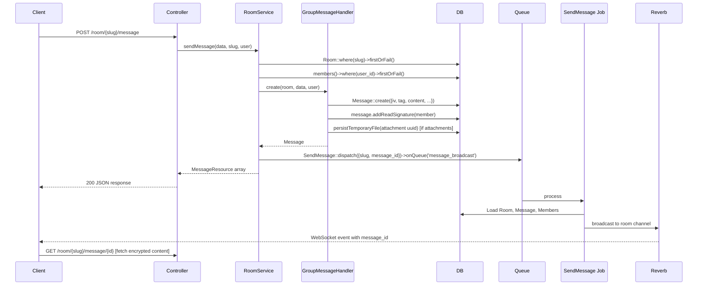

# Messages & Streaming

This article covers the full lifecycle of a message in a group room: how a message record is created, how it reaches room members over WebSocket, and how the AI response is produced and streamed back to the client.

:::note
This article covers group room messages. Private AI conversation messages (`AiConvMsg`) are covered in [200-Private-Conversations](200-Private-Conversations.md).
:::

## The `Message` Model

`App\Models\Message` stores group room messages. Content is always stored encrypted — the server never holds plaintext message content.

| Field | Type | Description |
|---|---|---|
| `room_id` | int | Foreign key to `rooms` |
| `member_id` | int | Foreign key to `members` (which member sent this) |
| `message_id` | string | Decimal-indexed position string, e.g. `3.000`, `3.001` |
| `message_role` | string | `'user'` or `'assistant'` |
| `model` | string\|null | AI model identifier for assistant messages |
| `iv` | string | AES-GCM initialisation vector (base64) |
| `tag` | string | AES-GCM authentication tag (base64) |
| `content` | string | Encrypted message ciphertext (base64) |
| `metadata` | json | `{ tools: [...], params: {...} }` — tool list and sampling parameters from the AI response |
| `reader_signs` | json | Array of member IDs that have read this message |
| `thread_id` | string\|null | Decimal ID of the parent message when this is a thread reply |
| `has_thread` | bool | True when this message has at least one reply |

### Encryption

All three fields `iv`, `tag`, and `content` together form an AES-256-GCM ciphertext. The room's symmetric key — held only by the client — is used for both encryption (before sending) and decryption (after receiving). The server stores and relays the ciphertext without ever being able to read it.

This means search, moderation, and any server-side content analysis are impossible by design for room messages.

### Threading

The `message_id` field is a decimal string that encodes the thread position:

- Top-level messages get whole-number IDs: `1.000`, `2.000`, `3.000`, …
- Thread replies under message `2` get sub-IDs: `2.001`, `2.002`, `2.003`, …

`AbstractMessageHandler::assignID()` computes the next ID by scanning existing messages and incrementing either the integer part (for top-level) or the decimal part (for replies).

`has_thread` on the parent message is flipped to `true` by an event listener when the first reply is created. This flag lets the frontend know to show a "show thread" button without loading the thread messages eagerly.

### Read Receipts

`reader_signs` is a JSON array of member IDs. `Message::addReadSignature($member)` appends the member's ID if not already present and dispatches `MessageUpdatedEvent`. The frontend shows a per-member "read" indicator driven by this field.

### Metadata

The `metadata` field is a JSON object written by the message handler:

```json
{
    "tools": ["web_search", "code_interpreter"],
    "params": {
        "model": "gpt-4o",
        "temperature": 0.7
    }
}
```

`getTools()` and `getParameters()` are convenience accessors on the model. The frontend uses these to display which tools the AI used and to reproduce the exact model settings when re-sending.

## Message Send Flow

The flow from a user pressing "send" to a message appearing in the room:



### Key design decisions

**Why is the message created before the WebSocket broadcast?** The `SendMessage` job is dispatched to the `message_broadcast` queue only after `GroupMessageHandler::create()` returns. The job then fetches the message from DB and broadcasts its `message_id` (not the content). The client receives the ID and fetches the encrypted content in a separate request. This means the content never travels over WebSocket — only the notification that a message exists.

**Why return the response immediately and broadcast asynchronously?** The HTTP response goes back to the sender with the newly created message data. The WebSocket broadcast happens via a queued job so the HTTP request doesn't block on WebSocket delivery. Other room members receive the push event; the sender already has the data from the HTTP response.

## The AI Response Path

The AI is always room member 1 (the user with `id = 1`, configured in `config/hawki.php` and set at DB migration time — it cannot be changed afterward). When a user sends a message that should trigger an AI response, a separate flow runs:

1. `StreamController::handleGroupChatRequest()` receives the streaming request.
2. It resolves the `AgentRegistry`, retrieves an agent for the request payload, and calls `$agent->sendStreaming()`.
3. Before streaming starts, the AI's response message record is written to the DB via `GroupMessageHandler::create()` with `message_role = 'assistant'`.
4. As streaming chunks arrive, they are sent to the client over the HTTP connection (server-sent events).
5. When streaming completes, `GroupMessageHandler::update()` is called to write the final encrypted content back into the already-existing message record.

**Why write the message record before streaming completes?** Other room members need to know an AI response is in progress. The empty-but-existing record (with `message_role = 'assistant'`) triggers `RoomAiWritingStartedEvent` and `RoomAiWritingEndedEvent` so the frontend can show a "typing" indicator before the full response arrives.

:::note
`StreamController::handleGroupChatRequest()` is a known tech-debt item — it is a 130-line method that mixes domain logic, encryption, model queries, and broadcasting. See the [Technical Debt Register](../100-Architecture/300-Technical-Debt.md) for details. Do not model new controller code on it.
:::

## `GroupMessageHandler`

`App\Services\Chat\Message\Handlers\GroupMessageHandler` handles the lifecycle of group room messages:

- `create(Room $conv, array $data, User $user): Message` — creates the DB record, resolves attachment identifiers from temporary to permanent storage, adds the sender's read signature, and dispatches `MessageSentEvent`.
- `update(Room $conv, array $data): Message` — updates content (encrypted payload), metadata, and model fields; dispatches `MessageUpdatedEvent`.
- `delete(Room $conv, array $data): bool` — deletes attachments and the message record.

`GroupMessageHandler` extends `AbstractMessageHandler`, which provides `assignID()` for computing the next decimal message ID.

## Events

| Event | Dispatched when |
|---|---|
| `MessageSentEvent` | After `GroupMessageHandler::create()` succeeds |
| `MessageUpdatedEvent` | After `GroupMessageHandler::update()` or `Message::addReadSignature()` |
| `RoomAiWritingStartedEvent` | When the AI starts generating a response |
| `RoomAiWritingEndedEvent` | When AI streaming completes or fails |

All events extend `AbstractMessageEvent` or `AbstractRoomAiWritingEvent` and live in `app/Services/Chat/Events/`.

## File Attachments in Messages

File attachments follow a two-step upload flow:

1. The client uploads the file to `/upload` (or the relevant upload endpoint). The backend calls `FileStorageService::storeTemporary()` with `StoredFileCategory::GROUP`. The returned UUID is sent back to the client.
2. When the message is sent, the client includes the UUID list in the message payload. `GroupMessageHandler::create()` calls `FileStorageService::persistTemporaryFile()` for each UUID, moving the file from the `temp/` area to permanent storage, and then creates an `Attachment` record via `AttachmentRepository::assignToMessage()`.

If the message is never sent (the user navigates away), the temporary file is cleaned up by the `filestorage:cleanup` artisan command, which removes files older than 5 minutes from the `temp/` area.

Attachment access is always proxied through `StorageProxyController`. The proxy checks room membership before serving `GROUP` category files. See [700-Storage-and-Files](../700-Storage-and-Files/index.md) for the full storage architecture.
