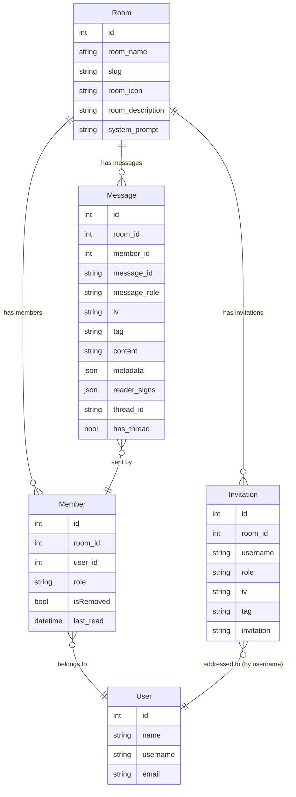

# Chat & Rooms

The chat domain is the most complex part of HAWKI's backend. It handles two distinct conversation modes — group rooms shared by multiple users and private one-to-one AI conversations — along with everything that surrounds them: membership, invitations, message encryption, threading, file attachments, and real-time WebSocket delivery.

This article covers the group room side: models, service structure, the invitation flow, and membership mechanics. Private AI conversations are covered in [200-Private-Conversations](200-Private-Conversations.md). Message lifecycle and streaming are covered in [100-Messages](100-Messages.md).

## The Two Conversation Types

| Feature | Group Room (`Room`) | Private AI Conversation (`AiConv`) |
|---|---|---|
| Participants | Multiple members (admin / editor / viewer / assistant) | Owner only |
| Encryption | Room key distributed per member via keychain | No room key — server enforces ownership |
| Invitations | `Invitation` model, encrypted invite data | None |
| File category | `StoredFileCategory::GROUP` | `StoredFileCategory::PRIVATE` |
| Read receipts | Yes (`reader_signs`) | No |
| Threading | Yes (`thread_id` / `has_thread`) | Yes (`message_id`) |
| Auto-delete | When only one member remains | When user deletes the conversation |

## Entity Relationships



## The `Room` Model

`App\Models\Room` is identified by a URL-safe slug generated automatically on creation by combining a slugified room name with six random characters (e.g. `my-project-a1b2c3`). The slug is stable for the lifetime of the room.

Key fields:
- `room_name` — display name, mutable
- `room_icon` — UUID of a stored avatar (via `StoredFileIdentifier`, `ROOM_AVATAR` category), nullable
- `system_prompt` — custom system instruction injected before the AI responds in this room
- `slug` — unique URL identifier, generated on create, never changes

The model uses `HasContextualScopesTrait` and registers `RoomAccessScope` as its contextual scope. When a non-CLI request is active, `RoomAccessScope` automatically filters every `Room` query to only the rooms the current user is a member of. This means you never accidentally expose another user's rooms when calling `Room::all()` or `Room::where(...)` from within request scope.

### Auto-Deletion

When `removeMember()` is called and the resulting member count drops to exactly 1 (the AI assistant is always member 1), the room calls `deleteRoom()` on itself. If the last removed member was an admin and no other admins remain, the room also deletes immediately. This cleanup logic currently lives directly in the `Room` model — it is a known tech-debt item.

## The `Member` Model

`App\Models\Member` represents a single user's membership in a room. Members are never hard-deleted: `revokeMembership()` sets `isRemoved = 1`. This soft-removal preserves history and allows the same user to rejoin via `recreateMembership()`.

The four roles and what they signify:

| Constant | Value | Who holds it |
|---|---|---|
| `ROLE_ADMIN` | `'admin'` | Room creator; full control including kicking others |
| `ROLE_EDITOR` | `'editor'` | Standard human member |
| `ROLE_VIEWER` | `'viewer'` | Read-only human member |
| `ROLE_ASSISTANT` | `'assistant'` | Always user 1, the AI agent |

The `last_read` timestamp updated by `updateLastRead()` drives the unread-message indicator on the frontend.

## Deferred Member Events

`Room::runWithDeferredMemberEvents(callable $callback): callable`

Bulk operations — creating a room with 20 invited members, re-joining a room after an invitation is accepted — must not fire events for each individual member while the overall state is still in flux. Listeners see the room mid-way through a bulk add and may miscount members, compute wrong audit logs, or trigger premature sync log entries.

`runWithDeferredMemberEvents()` solves this by collecting member events into a local array rather than dispatching them immediately. The callback runs normally; any call to `addMember()` or `removeMember()` inside it queues a closure instead of dispatching `MemberAddedToRoomEvent` / `MemberRemovedFromRoomEvent` / `MemberUpdatedEvent`. After the callback returns, the method hands back a callable — the caller invokes it once the outer transaction or state change is fully committed.

Concrete usage in room creation:

```php
$deferred = $room->runWithDeferredMemberEvents(function () use ($room) {
    $room->addMember(1, Member::ROLE_ASSISTANT); // AI agent
    $room->addMember(Auth::id(), Member::ROLE_ADMIN); // creator
});

RoomCreatedEvent::dispatch($room); // room exists with both members
$deferred(); // NOW fire MemberAddedToRoomEvent x2
```

Without this pattern, `MemberAddedToRoomEvent` would fire for the AI agent before the human admin member exists, and listeners building an audience list would produce an incomplete result.

## The Invitation Flow

When a room admin invites a user who does not yet have a room key, a new `Invitation` record is created. The invitation stores the encrypted room key material for the invitee — the server never sees the plaintext key.

`App\Models\Invitation` fields:

| Field | Description |
|---|---|
| `room_id` | The room being joined |
| `username` | Invitee identified by username (not user ID) |
| `role` | The role the invitee will receive on acceptance |
| `iv` | AES-GCM initialisation vector (base64) |
| `tag` | AES-GCM authentication tag (base64) |
| `invitation` | Encrypted room key ciphertext (base64) |

The `Invitation` model dispatches `InvitationCreatedEvent` on `created` and `InvitationUpdatedEvent` on `updated` via `$dispatchesEvents`. These events feed the SyncLog handler pipeline (the `room_invitation` entry type in the SyncLog design).

The `Invitation` → `User` relationship uses `username` as the join key (not `id`), which means invitations remain valid even if the invitee's user record is created after the invitation.

The `room-members` JSON:API resource combines `Member` and `Invitation` records into a unified response — a pending invitation appears as a "member" with a pending state on the frontend, allowing the room admin to see who has and has not yet accepted.

## `RoomService` Structure

`App\Services\Chat\Room\RoomService` is the public service entry point for room operations. Its constructor accepts a `GroupMessageHandler` (injected via the container). All method implementations live in three traits:

- `RoomFunctions` — create, load, update, delete, avatar assignment
- `RoomMembers` — add, kick, leave, user search
- `RoomMessages` — send, update, retrieve, mark-as-read

:::warning Known pre-refactor rough edge
`RoomService` uses PHP traits (`RoomFunctions`, `RoomMembers`, `RoomMessages`) to split its implementation across files. The HAWKI contributing guide explicitly labels this pattern as the `// ❌ Bad` approach for service decomposition. The correct pattern is to extract each area into a dedicated sub-service and expose it via a `public readonly` property on the parent service.

Additionally, the traits call `Auth::id()`, `Auth::user()`, `Log::error()`, and `app(AvatarStorageService::class)` directly — all of which violate HAWKI's no-facades-in-services and no-`app()`-helpers rules.

Do not copy this structure in new code. See the [Technical Debt Register](../100-Architecture/300-Technical-Debt.md) for the full list of violations in this area.
:::

## `RoomAccessScope`

`App\Models\Scopes\RoomAccessScope` is registered as a contextual scope on the `Room` model under the key `'access'`. When active in a request context, it adds a `whereHas('members', ...)` constraint that restricts results to rooms where the current user is a member.

Because it is a contextual scope (not a plain Eloquent global scope), it can be bypassed for specific queries using the sandboxed scope API:

```php
use App\Services\System\Database\Eloquent\ContextualScopes\ModelScopeContext;

ModelScopeContext::runSandboxed(function () {
    ModelScopeContext::disableScope(Room::class, 'access');
    return Room::all(); // no membership filter
});
```

This is the mechanism admin commands use to iterate over all rooms without being restricted to the current user's membership.

## System Prompt Providers

Every room can carry a custom `system_prompt`. When the AI assembles its context for a message, `SystemPromptProvider` resolves the appropriate prompt by checking, in priority order:

1. The room's own `system_prompt` field (if set)
2. The system-level default prompt for the current locale

Prompts are typed (`DEFAULT`, `SUMMARY`, `IMPROVEMENT`, `NAME`) and locale-aware via the contextual scope system on the `SystemPrompt` model. Room-level overrides always win.

## Where to Go Next

| Goal | Read |
|---|---|
| Understand message encryption and the streaming send flow | [100-Messages](100-Messages.md) |
| Understand private AI conversations | [200-Private-Conversations](200-Private-Conversations.md) |
| Understand how room key encryption works | [800-Encryption-and-Security](../800-Encryption-and-Security/index.md) |
| Understand how file attachments are stored and served | [700-Storage-and-Files](../700-Storage-and-Files/index.md) |
