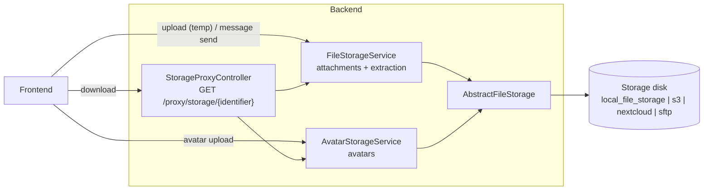

# Storage & Files

HAWKI's file storage layer is divided into three subsections, which are configured separately:

1. File storage (data repo for attachments)
2. Avatar storage
3. Laravel framework has a "default" as fallback, which issues a warning in HAWKI when used unexpected.

Architecturally the storage system has one hard rule: **the application only ever links proxy URLs** — every download travels through a PHP controller that checks access rights and streams the content. Attachment files are never stored on a directly served path. Avatar files are technically reachable via the `/storage/` symlink on their default `public` disk, which is acceptable since avatars are world-readable by design.

Around that rule, dealing with the filesystem involves five responsibilities, each with its own configuration:

- **Uploading** — two storage services accept uploads, each with its own size limit and MIME allowlist (`FileStorageService`, `AvatarStorageService` — configured in `filesystems.upload_limits`)
- **Placement** — each storage role writes to its own swappable disk, from local disk to the target (configured in `filesystems.file_storage` / `filesystems.avatar_storage`)
- **Serving** — the storage proxy enforces per-category access rules and streams the bytes (route `web.storage.proxy`, rules in `StorageProxyController`)
- **Extracting** — the file-converter pipeline turns documents into text extracts the AI can read (configured in `file_converter`)
- **Cleaning up** — garbage collection removes abandoned temp uploads and expired attachments (configured in `filesystems.garbage_collections`)

## Overview

All file handling in HAWKI follows one architecture: uploads go through a **storage service**, files live on a **configurable storage disk**, and downloads are only ever served through the **storage proxy**. All storage types share this mechanism — what differs is their **scope** and their configuration:

| Storage type | Stored content | Access scope | Own configuration |
|---|---|---|---|
| Attachments (`FileStorageService`) | Files attached to messages (`GROUP` / `PRIVATE` categories) | Strictly access-controlled — room members or owner only | `MAX_FILE_SIZE`, `ALLOWED_FILE_MIME_TYPES`, `MAX_ATTACHMENT_FILES`, disk via `STORAGE_DISK` |
| Avatars (`AvatarStorageService`) | User profile and room avatars (`PROFILE_AVATAR` / `ROOM_AVATAR` categories) | Public — world-readable, served via proxy (directly reachable on the default `public` disk) | `MAX_AVATAR_FILE_SIZE`, `ALLOWED_AVATAR_MIME_TYPES`, disk via `AVATAR_STORAGE` |

- **Two services** do the work: `FileStorageService` (chat attachments, with text extraction so AI models can read documents) and `AvatarStorageService` (avatars, no extraction). Both extend `AbstractFileStorage`.
- **Uploads are two-phase**: a file is first staged under `temp/`, and only moved to its permanent location when the message referencing it is actually sent. Abandoned uploads are removed by garbage collection.
- **Reads are proxied**: every download request hits `StorageProxyController`, which checks access rights by file category and streams the bytes.
- The **storage backend is swappable** (local disk, S3, Nextcloud WebDAV, SFTP) without touching application code.

The diagram below shows the three paths a file can take — attachment uploads and avatar uploads each go through their dedicated service, while every download is served through the storage proxy; both services share the same abstract base and write to the configured storage disk:



### Storage disk roles

`config/filesystems.php` defines three independent disk roles. Each is resolved once at boot in `StorageServiceProvider` and bound to its service:

| Role | Config key | Env var | Default disk |
|---|---|---|---|
| File storage (data repo for attachments) | `filesystems.file_storage` | `STORAGE_DISK` | `local_file_storage` |
| Avatar storage | `filesystems.avatar_storage` | `AVATAR_STORAGE` | `public` |
| Laravel framework default | `filesystems.default` | `FILESYSTEM_DISK` | `local` |

The framework default disk is kept only as a fallback: no HAWKI code resolves it, and code that does (a bare `Storage::put(...)` or `disk()` without a name) logs a runtime warning via `DefaultDiskWarningFilesystemManager` instead of silently writing to the fallback disk.

The rest of this article covers the proxy controller, the `StoredFileIdentifier` format, the two-step upload flow, and configuration. The file conversion pipeline (for extracting text from documents) is covered in [100-File-Converter](100-File-Converter.md).

## The Storage Proxy

`App\Http\Controllers\StorageProxyController` is the single entry point for all file access. It is registered at the route `web.storage.proxy` and accepts a `StoredFileIdentifier` string as a path parameter.

```
GET /proxy/storage/{identifier}
```

The controller:

1. Parses the identifier string into a `StoredFileIdentifier`.
2. Dispatches to a private method based on `$identifier->category`.
3. Retrieves the file bytes via the appropriate storage service.
4. Returns a `StreamedResponse` with ETag-based caching headers.

### Access rules by category

| Category | Who can access |
|---|---|
| `PROFILE_AVATAR` | Anyone (no membership check) |
| `ROOM_AVATAR` | Anyone (no membership check) |
| `GROUP` | Only users who are members of the room the attachment belongs to |
| `PRIVATE` | Only the owner of the private AI conversation the attachment belongs to |

Avatar files are considered public-ish metadata — seeing another user's avatar or a room's icon does not reveal private content. Attachment files carry potentially sensitive content and are always access-controlled.

### ETag caching

The controller checks the `If-None-Match` request header against an ETag derived from the file's stored metadata. If they match, it returns `304 Not Modified` without re-streaming the file body. This allows browsers and HTTP caches to avoid redundant downloads.

## `StoredFileIdentifier`

`App\Services\Storage\Values\StoredFileIdentifier` is the central handle for a file in storage. It combines a category and a UUID into a short string that can be passed through routes, stored in database columns, and serialized to JSON.

**String format:** `{category}-{uuid}[.{extension}]`

Examples:

```
private-550e8400-e29b-41d4-a716-446655440000.pdf
group-a1b2c3d4-e5f6-7890-abcd-ef1234567890
room_avatars-b3c4d5e6-f7a8-9012-bcde-f01234567890
```

The extension is optional and is metadata only — it is the original file extension and is used to restore the correct filename when serving the file. The actual file on disk may have a `.blob` extension for security reasons (see below).

Factory methods:

```php
// From a route parameter or stored string
$id = StoredFileIdentifier::fromString($routeParam);

// From a User or Room model (for avatars)
$id = StoredFileIdentifier::tryFromUserAvatar($user); // returns null if no avatar
$id = StoredFileIdentifier::tryFromRoomAvatar($room);

// Create a new identifier for an upload
$id = StoredFileIdentifier::fromCategoryAndFilename(StoredFileCategory::GROUP, 'document.pdf');

// From a known UUID
$id = StoredFileIdentifier::fromCategoryAndUuid(StoredFileCategory::PRIVATE, $uuid);
```

### Frontend UUID linkage

The UUID component of a `StoredFileIdentifier` is the same value that appears as the `uuid` field in `OldUiFileData` on the frontend. When the backend returns a stored file identifier after upload, the frontend records the UUID and includes it in the message payload when sending a message. This links the backend storage identity to the frontend's attachment tracking.

## `StoredFileCategory`

`App\Services\Storage\Values\StoredFileCategory` is a backed enum:

| Case | Value | Used for |
|---|---|---|
| `ROOM_AVATAR` | `'room_avatars'` | Group room icons |
| `PROFILE_AVATAR` | `'profile_avatars'` | User profile avatars |
| `GROUP` | `'group'` | Files attached to group room messages |
| `PRIVATE` | `'private'` | Files attached to private AI conversation messages |

The category value becomes the top-level directory on the storage disk.

## File Layout on Disk

Files are organized with 4-level UUID sharding to avoid filesystem limits on directories with large numbers of files:

```
{category}/
└── {uuid[0]}/
    └── {uuid[1]}/
        └── {uuid[2]}/
            └── {uuid[3]}/
                └── {uuid}/
                    ├── {uuid}.{ext|blob}   ← the stored file
                    ├── .meta.json          ← metadata sidecar
                    └── output/             ← content extracts (if any)
                        └── extract.md
```

Temporary files (pre-message-send uploads) live under an additional `temp/` prefix:

```
temp/{category}/{uuid[0]}/{uuid[1]}/{uuid[2]}/{uuid[3]}/{uuid}/
```

### `.blob` extension security

Only the extensions `pdf`, `doc`, `docx`, `jpg`, `jpeg`, `png`, and `gif` are preserved as-is on disk. All other file types are stored with a `.blob` extension. This prevents a browser from executing a file if the storage disk is ever misconfigured to be publicly accessible. The original extension is saved in `.meta.json` and restored when the file is served.

### `.meta.json` sidecar

Every stored file has a `.meta.json` sidecar generated at write time. It contains:

- Original filename
- MIME type
- File size
- Content references (paths to extract files in `output/`)
- Creation timestamp

When `retrieve()` encounters a file directory without a `.meta.json` (a pre-metadata legacy file), it reconstructs the sidecar from the attachment database and writes it to disk so subsequent accesses take the fast path.

## Two-Step Upload Flow

Attachments must be uploaded before the message that references them exists. To avoid orphaned permanent files, the storage system uses a two-phase approach:

```
Step 1 — Upload
Client → POST /upload
Backend: FileStorageService::storeTemporary($fileRef, StoredFileCategory::GROUP)
↳ File lands in temp/{category}/...
↳ Returns StoredFile with identifier

Step 2 — Message send (separate request)
Client → POST /room/{slug}/message  [includes attachment UUIDs]
Backend: GroupMessageHandler::create(...)
↳ FileStorageService::persistTemporaryFile($identifier) for each UUID
↳ Moves file from temp/ to permanent location
↳ AttachmentRepository::assignToMessage($message, $storedFile, $user)
```

If the user abandons the message without sending, the `filestorage:cleanup` artisan command removes temporary files older than 5 minutes during its next scheduled run.

## Upload Constraints and Frontend Validation

The upload constraints are delivered to the frontend through the public-config block of the connection bootstrap and feed the pre-upload validation in `AttachmentAspect.add()`. They are derived at runtime from the storage services (`FileStorageConfig` / `AvatarStorageConfig`), so the frontend always reflects exactly the limits the backend enforces — the two layers cannot diverge:

| Public-config key | Description |
|---|---|
| `storage_files.maxFileSize` | Maximum attachment file size in bytes |
| `storage_files.allowedMimeTypes` | MIME types the frontend accepts for attachments |
| `storage_files.allowedExtensions` | File extensions derived from the allowed MIME types |
| `storage_avatars.*` | Same keys for avatar uploads (2 MB default, image types only) |

:::caution
The backend default for `maxFileSize` is **10 MB** (10485760 bytes), configured via `MAX_FILE_SIZE` in `config/filesystems.php` (`filesystems.upload_limits.max_file_size`). The effective limit is additionally capped by the PHP `upload_max_filesize` and `post_max_size` settings — whichever is smallest wins. The `.env.example` suggests raising it to 20 MB (`20971520`).
:::

Additional constraint: `MAX_ATTACHMENT_FILES` controls the maximum number of attachments per message (default `0` = unlimited).

## Storage Services

### `FileStorageService`

`App\Services\Storage\FileStorageService` handles general file uploads — group room attachments and private conversation files. Content extraction is enabled: every file stored via this service triggers a text extraction pass so AI models can read document contents.

Accepted MIME types are the union of:
- Common image types: PNG, JPEG/JPG, GIF
- All plain-text and source-code types known to `PlainTextLanguageType`
- Any type the active `FileConverterInterface` implementation accepts (e.g. PDF, Word documents)

An admin-configured MIME allowlist (`ALLOWED_FILE_MIME_TYPES` env var, surfaced to the frontend as `storage_files.allowedMimeTypes`) can further restrict which types are accepted at runtime.

### `AvatarStorageService`

`App\Services\Storage\AvatarStorageService` handles avatar uploads. Content extraction is disabled (`$extractFileContent = false`). Accepted MIME types are image types only.

Maximum avatar file size is 2 MB (separate from the general attachment limit).

### `AbstractFileStorage`

Both services extend `App\Services\Storage\AbstractFileStorage`, which implements the `StorageServiceInterface` contract:

```php
store(FileReference $file, StoredFileCategory $category): StoredFile|null
storeTemporary(FileReference $file, StoredFileCategory $category): StoredFile|null
persistTemporaryFile(StoredFileIdentifier $identifier): bool
retrieve(StoredFileIdentifier|null $identifier, bool $temp = false): ?StoredFile
delete(StoredFileIdentifier|null $identifier, bool $temp = false): bool
getMaxFileSize(): int
getAllowedMimeTypes(): array
```

### `ContentExtractor`

`App\Services\Storage\Utils\ContentExtractor` decouples text extraction from storage. It runs after a file is written and calls the active `FileConverterInterface` to produce extract files in the `output/` subfolder. The `StoredFile`'s `getExtracts()` method returns a `FileCollection` of `StoredFileExtract` instances, each of which the AI service reads as context for the conversation.

## Storage Backends

The storage disk is configured per service in `config/filesystems.php` and selected by environment variables:

| Backend | When to use |
|---|---|
| Local (`local_file_storage`) | Development and single-server deployments |
| Amazon S3 (`s3`) | Cloud deployments; configure `S3_ACCESS_KEY`, `S3_SECRET_KEY`, `S3_REGION`, `S3_DEFAULT_BUCKET` |
| Nextcloud WebDAV (`nextcloud`) | On-premise deployments using Nextcloud |
| SFTP (`sftp`) | Any SFTP-accessible server |

The `check:storage` artisan command smoke-tests the storage the app actually uses: by default it resolves the three storage roles (framework default, file storage, avatar storage) and round-trips each of their disks (connectivity, write, read, delete), printing a PASS/FAIL table — roles that share a disk are checked once and grouped in one row. `--filesystem=s3,nextcloud` explicitly tests other configured disks instead, e.g. to verify a backend before switching a role to it. Disks with incomplete configuration are reported as failures with a hint about the missing environment variables, and the command exits non-zero when any disk fails, so it can be used as a health check.

## Garbage Collection

`filestorage:cleanup` deletes:

1. Temporary files that have been in `temp/` for more than 5 minutes (unconfirmed uploads)
2. Attachment files whose parent message or conversation has been deleted (6-month retention period for soft-deleted content)

Run this command on a schedule in production. The default Docker setup includes it as a scheduled task.
