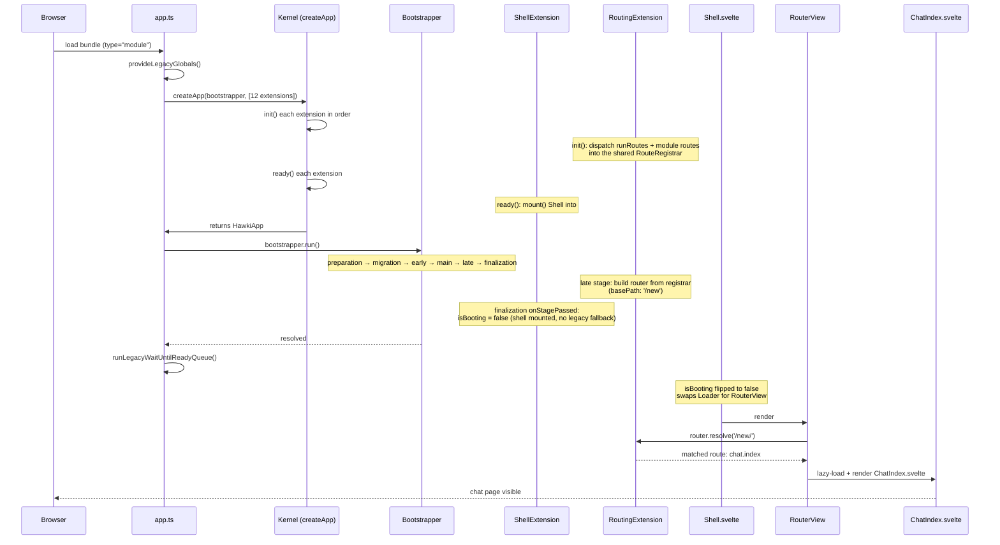

# Life of a Routed Page

A user navigates to the chat index page (`/new/`). We follow the request from the moment the bundle loads, through the boot sequence, the route match, and into the rendered component. This is the cleanest path through the SPA shell — the path the whole frontend is migrating toward.

## Scenario

The page has a `<div id="hawki-app">` mount point, so the SPA shell mounts. The user lands on `/new/` (the chat module's root route, registered by `ChatModule`).

## Sequence



## Step by step

### 1. Bundle loads — `app.ts`

The page loads `app.ts` as a `type="module"` script. The browser has finished parsing the DOM by the time the module executes, so `#hawki-app` is already present. `app.ts` guards against double-inclusion, publishes the legacy globals (so legacy scripts can still reach the app during the transition), then creates a `Bootstrapper` and calls `createApp(bootstrapper, [12 extensions])`. See [Architecture → The App & Kernel](../300-Architecture/100-App-and-Kernel.md).

### 2. Assembly — `createApp()`

Each extension's `init()` runs in array order. The two that matter for this request:

- `PluginExtension.init()` discovers the `core` plugin (auto-glob `$lib/plugins/**/*.plugin.ts`) and dispatches its `init`/`extensions`/`resourceSchemas` hooks. The core plugin registers `ChatModule` via `modules()` later (when `ModuleExtension.init()` runs).
- `RoutingExtension.init()` feeds its shared `RouteRegistrar` in two passes: first every plugin's `routes()` (the core plugin declares `/` → `Index.svelte`), then every module's `routes()` (`ChatModule` declares `/` → `ChatIndex.svelte` and `/room/:id` → `ChatConversation.svelte`, namespaced under the plugin prefix).

`ready()` then runs on each extension. `ShellExtension.ready()` immediately calls `mount()`, which finds `#hawki-app` and mounts `Shell.svelte` into it — `isBooting` is still `true`, so `Shell` renders its `Loader`. See [Architecture → Modules & Routing](../300-Architecture/120-Modules-and-Routing.md).

### 3. Boot — `bootstrapper.run()`

The six stages run in order (`preparation → migration → early → main → late → finalization`). The ones that matter here:

- **`preparation`** — `ClientExtension` fetches the connection, `ConfigurationExtension` fetches the config. Everything else depends on both. `PluginExtension.ready()` schedules `plugin.boot()` to run once `preparation` passes (the core plugin has no `boot()`, so nothing happens there).
- **`main`** — `StoreExtension` calls `loadData(app)` on every store that implements it (the chat page reads the `ai-models` store, which loads here). `LocalizationExtension` loads the active locale's translation labels.
- **`late`** — `RoutingExtension.ready()` compiles the registrar into a `universal-router` router (`createRouterFromRegistrar('app', …, { basePath: '/new', strategy: 'path' })`) and stores it as `app.__router` (exposed publicly as the narrower `app.router` handle).
- **`finalization`** — `ShellExtension` flips `isBooting` to `false`. Because a shell was mounted (`isMounted === true`), the legacy snippet fallback is skipped. `PluginExtension.ready()` scheduled `plugin.ready()` to run at `onStageReached('finalization')` — the core plugin has no `ready()`, so nothing happens there either.

See [Architecture → App Startup](../300-Architecture/110-App-Startup.md) for the full stage table.

### 4. Render — `Shell.svelte` → `RouterView`

`Shell.svelte` is minimal: it provides the app via Svelte context (`provideApp`), sets up the toast context, and renders:

```svelte
<Loader active={app.isBooting}>
    <RouterView router={(app as any).__router}/>
</Loader>
```

Once `isBooting` flips to `false`, the `Loader` swaps out and `RouterView` takes over. `RouterView` calls `router.resolve('/new/')` against the compiled router. The registrar collected the `ChatModule` route `/` (under the core plugin's empty prefix), so the match resolves to the `chat.index` route and its lazy loader.

### 5. The page — `ChatIndex.svelte`

`RouterView` calls the route's lazy loader (`async () => import('./pages/ChatIndex.svelte')`), imports the component, and renders it. `ChatIndex.svelte` is a feature module component — it reaches the app through the hooks (`useStore('ai-models')`, `useConfig()`, `useTranslator()`, …) set up by the boot sequence that just completed.

The chat composer mounted inside the page creates its `ComposerContext` via `createComposerContext(app, 'aiConv', toastContext)`, pulling the stores it needs from `app.stores`. See [Core Plugins → Chat Module](../500-Core-Plugins/100-Core/110-Chat-Module.md) for how the composer works.

## Where the other layers appear

This tutorial walks the SPA-shell path. The other layers a contributor will meet:

| Layer | Where to read |
|---|---|
| The extension list and what each extension owns | [Architecture → The App & Kernel](../300-Architecture/100-App-and-Kernel.md) |
| The boot stages in full detail | [Architecture → App Startup](../300-Architecture/110-App-Startup.md) |
| The router, route registrar, and module metadata | [Architecture → Modules & Routing](../300-Architecture/120-Modules-and-Routing.md) |
| How a component reaches config/stores/translations | [Concepts → Data Layer](../200-Concepts/130-Data-Layer.md), [Stores](../200-Concepts/120-Stores.md), [Translations](../200-Concepts/140-Translations.md) |
| The composer (chat input) | [Core Plugins → Chat Module](../500-Core-Plugins/100-Core/110-Chat-Module.md) |
| The legacy snippet fallback (not taken on this page) | [Roadmap → Snippet System](../700-Roadmap/200-Snippet-System.md) |
| The legacy UI bridge (used by the composer's transport) | [Roadmap → Legacy UI Bridge](../700-Roadmap/100-Legacy-UI-Bridge.md) |
