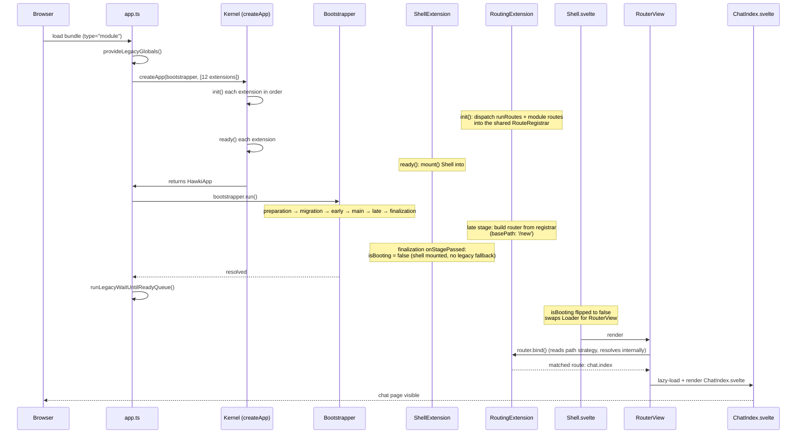

# App Startup

The HAWKI frontend does not run feature code immediately on page load. `app.ts` assembles a `HawkiApp` from an ordered list of extensions via `createApp(bootstrapper, […])`, then calls `bootstrapper.run()` once. This page covers the boot stages themselves and how a routed page travels through them from bundle load to rendered component. For what the kernel is, the `app.*` surface, and how the two bootstrappers interplay, see [The App & Kernel](index.md).

## Boot stages

| Stage          | What runs here                                                                                                                                                                                                                                                                                                                                                   |
|----------------|------------------------------------------------------------------------------------------------------------------------------------------------------------------------------------------------------------------------------------------------------------------------------------------------------------------------------------------------------------------|
| `preparation`  | `ClientExtension` fetches the connection; `ConfigurationExtension` fetches the config — both run concurrently. Everything else depends on both. `PluginExtension.ready()` schedules `plugin.boot()` to run once `preparation` passes.                                                                                                                            |
| `migration`    | *(currently unused — reserved for schema or storage migrations)*. Frontend migrations run on demand via `app.migration.apply(runType)` after login/passkey, not on a boot stage.                                                                                                                                                                                 |
| `early`        | *(currently unused — reserved for services that `main`-stage work depends on)*                                                                                                                                                                                                                                                                                   |
| `main`         | `StoreExtension` calls `loadData(app)` on every store that implements it; `LocalizationExtension` loads the active locale's translation labels — all concurrent. Plugins may add more `main`-stage work from their `boot()` hook.                                                                                                                                |
| `late`         | `RoutingExtension.ready()` builds the router from the collected route registrations (`createRouterFromRegistrar('app', …)`).                                                                                                                                                                                                                                     |
| `finalization` | `ShellExtension.ready()` mounts the SPA `Shell` (if `#hawki-app` exists) and registers a `DOMContentLoaded` wait; on `onStagePassed('finalization')` it flips `isBooting` to `false` and, if no shell was mounted, falls back to `legacyInitializeSnippetApps`. `PluginExtension.ready()` schedules `plugin.ready()` to run at `onStageReached('finalization')`. |

The `migration` and `early` stages are intentionally empty in the current codebase. They exist as reserved slots for future work that must run after `preparation` but before `main`.

`bootstrapper.run()` is idempotent: subsequent calls return the same promise as the first call.

## Life of a routed page

A user navigates to the chat index page (`/new/`). We follow the request from the moment the bundle loads, through the boot sequence, the route match, and into the rendered component. This is the cleanest path through the SPA shell.

### Sequence



### Assembly — `createApp()`

Each extension's `init()` runs in array order. The two that matter for this request:

- `PluginExtension.init()` discovers the `core` plugin (auto-glob `$lib/plugins/**/*.plugin.ts`) and dispatches its `init`/`extensions`/`resourceSchemas` hooks via `PluginBootstrapper`. The core plugin registers `ChatModule` via `modules()` later (when `ModuleExtension.init()` runs).
- `RoutingExtension.init()` feeds its shared `RouteRegistrar` in two passes: first every plugin's `routes()` (the core plugin declares `/` → `Index.svelte`), then every module's `routes()` (`ChatModule` declares `/` → `ChatIndex.svelte` and `/room/:id` → `ChatConversation.svelte`, namespaced under the plugin prefix).

`ready()` then runs on each extension. `ShellExtension.ready()` immediately calls `mount()`, which finds `#hawki-app` and mounts `Shell.svelte` into it — `isBooting` is still `true`, so `Shell` renders its `Loader`. See [Modules & Routing](120-Routing-and-Shell.md).

### Boot — `bootstrapper.run()`

The six stages run in order. The ones that matter here:

- **`preparation`** — `ClientExtension` fetches the connection, `ConfigurationExtension` fetches the config. Everything else depends on both.
- **`main`** — `StoreExtension` calls `loadData(app)` on every store that implements it (the chat page reads the `ai-models` store, which loads here). `LocalizationExtension` loads the active locale's translation labels.
- **`late`** — `RoutingExtension.ready()` compiles the registrar into a `universal-router` router (`createRouterFromRegistrar('app', …, { basePath: '/new', strategy: 'path' })`) and stores it as `app.__router` (exposed publicly as the narrower `app.router` handle).
- **`finalization`** — `ShellExtension` flips `isBooting` to `false`. Because a shell was mounted (`isMounted === true`), the legacy snippet fallback is skipped.

### Render — `Shell.svelte` → `RouterView`

`Shell.svelte` is minimal: it provides the app via Svelte context (`provideApp`), sets up the toast context, and renders:

```svelte
<Loader active={app.isBooting}>
    <RouterView router={(app as any).__router}/>
</Loader>
```

Once `isBooting` flips to `false`, the `Loader` swaps out and `RouterView` takes over. `RouterView` calls `router.bind()`, which wires the router to its routing strategy — here the `path` strategy, so it reads `window.location.pathname` (`/new/`) and triggers resolution internally. The registrar collected the `ChatModule` route `/` (under the core plugin's empty prefix), so the match resolves to the `chat.index` route and its lazy loader. See [Routing](../190-Routing.md) for how the router resolves and renders.

### The page — `ChatIndex.svelte`

`RouterView` calls the route's lazy loader, imports the component, and renders it. `ChatIndex.svelte` reaches the app through the hooks (`useStore('ai-models')`, `useConfig()`, `useTranslator()`, …) set up by the boot sequence that just completed.

## Registering work in a stage

Each stage exposes three registration points that control precisely when a handler runs relative to that stage. Extensions register these from their `init()`/`ready()`; you rarely call them outside an extension.

### `onStageReached(stage, handler)`

Runs **before** the stage starts, serially. Use this to set up preconditions that the stage's concurrent handlers depend on. All `onStageReached` handlers for a stage complete before any `onStage` handlers begin.

```ts
import type {Bootstrapper} from '$lib/kernel/Bootstrapper.js';

public
init(app
:
UnfinishedHawkiApp, bootstrapper
:
Bootstrapper
)
{
    bootstrapper.onStageReached('main', async (bootstrap) => {
        await ensurePrecondition();
    });
}
```

### `onStage(stage, handler)`

Runs **during** the stage, concurrently with other handlers registered for the same stage (up to the concurrency limit of 3). This is where most feature setup goes. Returns a cleanup function that deregisters the handler. Named shorthands exist: `onPreparationStage`, `onMigrationStage`, `onEarlyStage`, `onMainStage`, `onLateStage`, `onFinalizationStage`.

```ts
public
init(app
:
UnfinishedHawkiApp, bootstrapper
:
Bootstrapper
)
{
    bootstrapper.onMainStage(async (bootstrap) => {
        await loadMyFeature();
    });
}
```

### `onStagePassed(stage, handler)`

Runs **after** the stage completes, serially. Use this to react to a stage finishing without blocking the next stage from starting.

### Late registration

If a handler is registered after its target stage has already passed, it is called immediately and a console warning is emitted. Late registration is never silently dropped.

## Stage concurrency

Within each stage, handlers registered via `onStage` (and the named shorthands) run concurrently with a cap of 3 simultaneous handlers (a sliding window, not fixed batches). The stage does not advance until all handlers have resolved.
