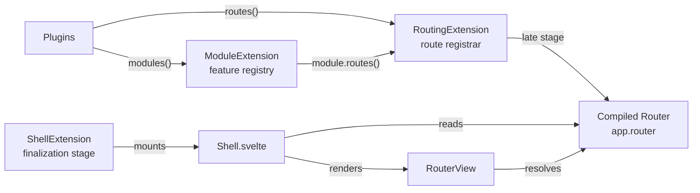

# Routing & the SPA Shell

How `RoutingExtension`, `ShellExtension`, and `RouterView` fit together. For the routing concept (pages, layouts, data loading, middleware), see [Routing](../190-Routing.md). For modules, see [Modules](../200-Modules.md).

:::info[Migration phase — `/new` base route]
The SPA router is the direction. To keep the new SPA and the legacy Blade UI separate during the migration, the router is currently built with a hardcoded `basePath: '/new'` (see `RoutingExtension.ready()`). When the next release ships, the SPA becomes the primary path and the base route is read from config instead. Until then, legacy pages (no `#hawki-app` mount point) fall back to the snippet system.
:::

## The three pieces

| Piece | Extension | Job |
|---|---|---|
| Feature modules | `ModuleExtension` | Registry of modules (`core:chat`, …). See [Modules](../200-Modules.md). |
| Route registry + router | `RoutingExtension` | Collects route registrations from plugins and modules during `init()`, compiles them into a `universal-router` router on the `late` stage (in `ready()`), exposes the handle as `app.router`. |
| SPA shell | `ShellExtension` | Mounts the `Shell.svelte` root component into `#hawki-app` (if present) and drives the legacy snippet fallback otherwise. |

## RoutingExtension

`RoutingExtension` owns one shared `RouteRegistrar`. During `init()` it feeds the registrar in two passes:

1. Every plugin's `routes(registrar, context)` hook, dispatched through `PluginBootstrapper.runRoutes()` — already wrapped in a `registrar.group(...)` carrying the plugin's route prefix (empty for core plugins, `/plugins/<slug>` otherwise).
2. Every registered module's `routes(registrar)` hook — already wrapped in a `registrar.group(...)` carrying the module's route prefix.

The router is a one-time snapshot: on the `late` stage, `ready()` compiles the registrar into a `universal-router` instance via `createRouterFromRegistrar` (which calls `registrar.build()` internally) and exposes the result as `app.router` (a `RouterHandle`). Nothing re-reads the registrar afterwards, so registering routes after that point has no effect on `app.router`. `app.__router` is the `@internal` escape hatch that exposes the full `Router` instance — used only by `RouterView` inside the shell.

The route registration API (`lazyRoute`, `route`, `group`), the `configurePage` / `configureLayout` config pattern, and the render-chain model are documented in [Routing](../190-Routing.md).

## The SPA Shell

`ShellExtension` mounts the SPA root. In `ready()` (which runs after every extension is assembled):

1. It calls `mount()` immediately — `mount()` looks for `#hawki-app` and, if found, mounts `Shell.svelte` into it. Returns `false` (without throwing) when the element is absent.
2. It registers a `DOMContentLoaded` wait on the `finalization` stage so the legacy fallback and other finalization work can depend on the DOM being ready.
3. On `onStagePassed('finalization')` it flips `isBooting` to `false` (so `Shell` swaps its `Loader` for `RouterView`) and, **if no shell was mounted**, calls `legacyInitializeSnippetApps` — the legacy snippet fallback.

`Shell.svelte` is minimal: it provides the app via Svelte context (`provideApp`), sets up the shared toast context, and renders `Loader` while booting / `RouterView` once booted.

The shell's mount state is exposed on `app`:

| Property | Type | Notes |
|---|---|---|
| `app.isMounted` | `boolean` | `true` once a `#hawki-app` mount point was found and `Shell` mounted. |
| `app.isBooting` | `boolean` | `true` until the `finalization` stage passes; `Shell` shows `Loader` while true. |
| `app.mountPoint` | `HTMLElement` | The element `Shell` is mounted into (throws if not mounted). |
| `app.mount(selector?)` | `boolean` | Mount `Shell` into an element/selector. `false` if already mounted or target absent. |
| `app.unmount()` | `Promise<void>` | Unmount and clear the mount point. |

## Where to go next

| I want to… | Read |
|---|---|
| Understand routing (pages, layouts, data loading) | [Routing](../190-Routing.md) |
| Understand modules | [Modules](../200-Modules.md) |
| Register a feature module or routes | [Extending HAWKI](../../../800-Plugins/200-Extending-HAWKI/index.md) |
| Understand the boot stages the shell mounts on | [App Startup](110-App-Startup.md) |
