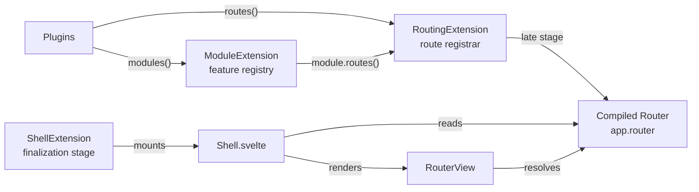

# Modules & Routing

HAWKI's frontend is becoming a single-page app. The pieces that make that work — feature modules, the route registry, the router, and the SPA shell that mounts it — are wired through three kernel extensions: `ModuleExtension`, `RoutingExtension`, and `ShellExtension`. This page covers how they fit together.

:::info[Migration phase — `/new` base route]
The SPA router is the direction. To keep the new SPA and the legacy Blade UI separate during the migration, the router is currently built with a hardcoded `basePath: '/new'` (see `RoutingExtension.ready()`). When the next release ships, the SPA becomes the primary path and the base route is read from config instead. Until then, legacy pages (no `#hawki-app` mount point) fall back to the snippet system.
:::

## The three pieces



| Piece | Extension | Job |
|---|---|---|
| Feature modules | `ModuleExtension` | Registry of modules (`core:chat`, …). A module bundles a name, optional title/icon/sidebar metadata, and a `routes()` callback. |
| Route registry + router | `RoutingExtension` | Collects route registrations from plugins and modules, compiles them into a `universal-router` router on the `late` stage, exposes the handle as `app.router`. |
| SPA shell | `ShellExtension` | Mounts the `Shell.svelte` root component into `#hawki-app` (if present) and drives the legacy snippet fallback otherwise. |

## Feature Modules

A `HawkiModule` is HAWKI's unit of "one logical feature". It bundles everything one feature needs behind a single `name`:

- optional localisable `title`/`description`/`icon` (for sidebar/navigation)
- optional `sidebar` component (rendered in the app sidebar while the module is active)
- a `routes(registrar)` callback declaring the feature's pages

Modules are registered by a plugin's `modules()` hook. The `ModuleRegistrar` stores each under the globally unique key `${pluginName}:${module.name}` (so two plugins can't collide) and auto-prefixes any `routes()` the module declares with the plugin's route namespace.

```ts
// plugins/core/modules/chat/ChatModule.ts
export class ChatModule implements HawkiModule {
    readonly name = 'chat';

    public routes(registrar: RouteRegistrar): void | Promise<void> {
        registrar
            .lazyRoute('/', async () => import('./pages/ChatIndex.svelte'), {name: 'chat.index'})
            .lazyRoute('/room/:id', async () => import('./pages/ChatConversation.svelte'), 'chat.conversation');
    }
}
```

`lazyRoute` defers importing the page component until the route is actually navigated to, keeping it out of the initial bundle. Use `route` for eagerly imported pages.

The module metadata methods (`title`, `description`, `icon`, `sidebar`) each receive the active `Locale` and the `Translator` so a module can render its label/icon in the user's language. The app sidebar and module selector consume these.

## Routing

`RoutingExtension` owns one shared `RouteRegistrar`. During `init()` it feeds the registrar in two passes:

1. Every plugin's `routes(registrar, context)` hook, dispatched through `PluginBootstrapper.runRoutes()` — already wrapped in a `registrar.group(...)` carrying the plugin's route prefix (empty for core plugins, `/plugins/<slug>` otherwise).
2. Every registered module's `routes(registrar)` hook — already wrapped in a `registrar.group(...)` carrying the module's route prefix.

The router is a one-time snapshot: `init()` calls `registrar.build()` once and never re-reads the registrar, so registering routes after boot has no effect on `app.router`.

On the `late` stage, `ready()` compiles the registrar into a `universal-router` instance:

```ts
// RoutingExtension.ready()
bootstrapper.onLateStage(() => {
    this._router = createRouterFromRegistrar('app', this.registrar, {
        basePath: '/new',   // @todo read from config instead of hardcoding
        strategy: 'path'
    });
});
```

The compiled router is exposed as `app.router` (a `RouterHandle`). `app.__router` is the `@internal` escape hatch that exposes the full `Router` instance — used only by `RouterView` inside the shell.

### Route registration API

The `RouteRegistrar` (in `components/ui/routing/logistics/RouteRegistrar.ts`) is the surface plugins and modules register against. Key methods:

- `route(path, component, options?)` — register a route with an eagerly imported component.
- `lazyRoute(path, loader, options?)` — register a route with a lazy component loader (code-split). Preferred.
- `group(path, callback, options?)` — namespace a group of routes under a shared prefix/middleware/layout.

Routes support optional `meta` (typed per-route data — e.g. `{title: 'Chat'}`), middleware, layouts, and a `name` for reverse lookups. The full shape — including `configurePage` / `configureLayout`, the loader context, cache keys, and the render-chain model — is documented in [Concepts → Routing](../200-Concepts/180-Routing.md).

### The `RouterView` component

`components/ui/routing/RouterView.svelte` renders the matched route's component. It lives inside `Shell.svelte`:

```svelte
<!-- app/components/Shell.svelte -->
<Loader active={app.isBooting}>
    <RouterView router={(app as any).__router}/>
</Loader>
```

`RouterView` uses the full `Router` instance (reached via the `@internal` `__router`), while the public `app.router` handle exposes only the narrower navigation surface (`goTo`, `isActive`, `getPath`, …) components need. Route state (`data`, `params`, `route`) arrives as **props** from `RouterView`, never from `useRouter()`.

The routing kit also provides `RouteError` / `RouteNotFound` fallback components and three routing strategies (`path`, `hash`, `transient`). Its public surface is the barrel `components/ui/routing/index.ts`; see [Concepts → Routing](../200-Concepts/180-Routing.md) for the mental model.

## The SPA Shell

`ShellExtension` mounts the SPA root. In `ready()` (which runs after every extension is assembled):

3. It calls `mount()` immediately — `mount()` looks for `#hawki-app` and, if found, mounts `Shell.svelte` into it. Returns `false` (without throwing) when the element is absent.
2. It registers a `DOMContentLoaded` wait on the `finalization` stage so the legacy fallback and other finalization work can depend on the DOM being ready.
4. On `onStagePassed('finalization')` it flips `isBooting` to `false` (so `Shell` swaps its `Loader` for `RouterView`) and, **if no shell was mounted**, calls `legacyInitializeSnippetApps` — the legacy snippet fallback.

`Shell.svelte` is minimal: it provides the app via Svelte context (`provideApp`), sets up the shared toast context, and renders `Loader` while booting / `RouterView` once booted.

The shell's mount state is exposed on `app`:

| Property | Type | Notes |
|---|---|---|
| `app.isMounted` | `boolean` | `true` once a `#hawki-app` mount point was found and `Shell` mounted. |
| `app.isBooting` | `boolean` | `true` until the `finalization` stage passes; `Shell` shows `Loader` while true. |
| `app.mountPoint` | `HTMLElement` | The element `Shell` is mounted into (throws if not mounted). |
| `app.mount(selector?)` | `boolean` | Mount `Shell` into an element/selector. `false` if already mounted or target absent. |
| `app.unmount()` | `Promise<void>` | Unmount and clear the mount point. |

## Where to go next

| I want to… | Read |
|---|---|
| Register a feature module or routes | [Extending HAWKI](../../800-Plugins/200-Extending-HAWKI/index.md) |
| Understand the boot stages the shell mounts on | [App Startup](110-App-Startup.md) |
| See how plugins are discovered and dispatched | [Plugin Internals](130-Plugin-Internals.md) |
| Understand the legacy snippet fallback (being phased out) |
