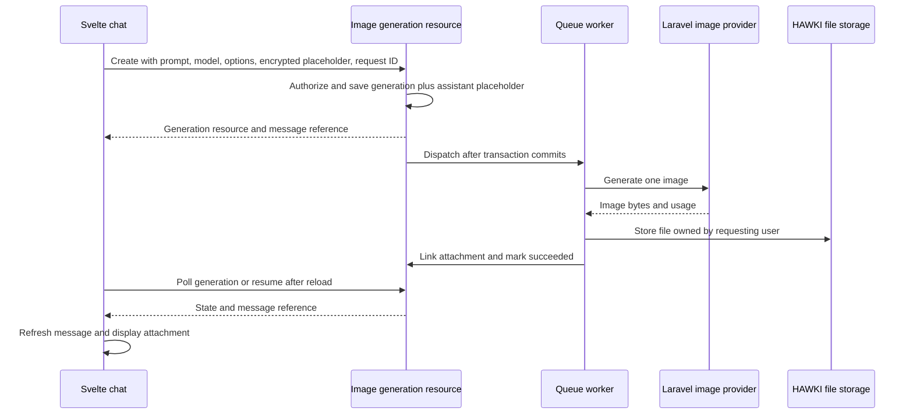

# Image generation implementation plan

Status: proposed implementation. Based on the [codebase readiness assessment](image-generation-readiness.md) and a follow-up inspection on 2026-09-15. This document does not enable generation or change application code.

## First release

Add an explicit **Create image** mode to the Svelte private-chat composer. The user selects an enabled image model, enters a prompt, and receives one downloadable image in an assistant message. The result survives navigation and reload. A failed request shows a useful error and allows an explicit retry.

Start with one configured OpenAI image model and its existing Laravel AI driver. Add Gemini after the first complete flow works, using the same application interface and provider-specific settings. The exact model IDs must be verified against the deployment's available models during implementation.

Reference-image editing, masks, multiple-image requests, automatic image tool calls during text chat, group conversations, and legacy UI support are follow-up work. The first release generates from the current prompt only; the composer should make that scope clear.

## Architecture decisions

1. Put generation behind an `ImageGenerationService` module under `app/Services/Ai/ImageGeneration/`. Its interface handles starting and retrieving a generation. It owns validation, scheduling, result storage, attachment linking, and failure state. Use the existing Laravel image-provider interface for provider variation rather than adding a second provider abstraction.
2. Add an `image-generations` JSON:API resource for the new frontend. Keep the existing text-agent response contract intact. Image generation has a dedicated client method and does not depend on extending `/req/streamAI` or `StreamController`.
3. Run provider work in a queue job. Poll the generation resource initially; websocket progress can be added later. Persist state so reconnecting does not invoke the provider again.
4. Save a client-encrypted assistant placeholder when creating the generation. The worker attaches the resulting file to that message and updates completion/state without needing a conversation encryption key.
5. Store image bytes through HAWKI's `FileStorageService`. Return ordinary attachment identifiers and access URLs. The client never needs a provider's temporary URL or base64 payload.

## 1. Model eligibility and provider execution

Relevant code: [provider adapters](../app/Services/Ai/Providers/Adapters/Implementations), [model repository](../app/Services/Ai/Models/Repositories/AiModelRepository.php), [provider resolver](../app/Services/Ai/Providers/AiProviderProxyResolver.php), [admin capabilities](../resources/js/plugins/admin/capabilities.ts).

- Define an image-generation settings object on the model for explicit enablement, allowed sizes/aspect ratios, allowed quality values, and defaults. Expose a validated executable capability to the frontend, separately from the existing descriptive `output: image` badge.
- Require an active model and provider, applicable usage rules, explicit generation enablement, and a resolved driver implementing Laravel's `ImageProvider`. Do not infer execution support solely from `model_type`; a model can support both text and image output.
- Resolve the model/provider through HAWKI's existing repositories and resolver. Pass the resolved driver to the installed SDK image method with an explicit model ID. Inspect each driver's supported options and test its actual request mapping.
- Normalize SDK results to image bytes, detected MIME type, dimensions, and usage. Reject empty or undecodable image output as a generation failure. Apply configured file-size and image-dimension limits before storing.
- Add server validation for supported settings. Display only settings supported by the selected provider/model. Start with one output image and a default square size.

Acceptance: fake-provider tests prove that enabled models generate with the selected settings and ineligible models fail before any provider call. Existing text generation still uses its current route.

## 2. Durable generation resource and queue job

Proposed files: `app/Models/Ai/ImageGeneration.php`, `app/Services/Ai/ImageGeneration/`, `app/Jobs/GenerateImage.php`, `app/JsonApi/V1/ImageGenerations/`, `app/Http/Controllers/Api/V1/ImageGenerationController.php`, `app/Policies/ImageGenerationPolicy.php`, and a database migration. Register the resource in [routes/api.php](../routes/api.php) and the JSON:API server.

- Store the requesting user, conversation, prompt-message and assistant-message references, selected model/provider references, options snapshot, client request ID, state, timestamps, safe error code, and usage. Store attachment references using the existing message attachment relationship.
- Enforce uniqueness on the requesting user plus client request ID. Repeating the same submission returns the existing generation; reusing its ID with different input returns a conflict. An explicit retry creates a new ID and generation.
- Create the generation and its encrypted assistant placeholder in one database transaction. Dispatch the job after commit. Keep the frontend's existing encrypted user-message save flow and reference that message in the generation request.
- Use states `queued`, `running`, `succeeded`, and `failed`. Claim a queued record atomically. A duplicate job must not start a second provider call or attach a second result.
- Check conversation ownership and model usage rules on submission. The worker resolves the stored user and usage context explicitly, rechecks eligibility, and does not depend on session authentication. Do not serialize a resolved provider or `ProviderDriverPortal` token into the job.
- Give provider requests a finite timeout, with the worker timeout and queue retry interval configured accordingly. A stale running record becomes a recoverable failure. Use one provider attempt initially; an ambiguous timeout must not silently cause a second paid generation.
- Make state/result retrieval owner-scoped and queryable by conversation so reload can restore pending messages. Expose polling links through the resource/client conventions. Stop polling at a terminal state or on navigation, then resume when reopening.

Acceptance: double submission and duplicate job delivery cause one provider invocation. Reload restores the generation. Unauthorized users cannot start, inspect, or recover another user's result. A worker crash eventually produces a visible terminal error.

## 3. Encryption, file persistence, and lifecycle

Relevant code: [FileReference](../app/Services/Storage/Values/FileReference.php), [AbstractFileStorage](../app/Services/Storage/AbstractFileStorage.php), [PrivateMessageHandler](../app/Services/Chat/Message/Handlers/PrivateMessageHandler.php), and [AiConvMessageSchema](../app/JsonApi/V1/AiConvMessages/AiConvMessageSchema.php).

- The client encrypts a small stable assistant body, such as an image-result caption, with the existing conversation key before submission. Persist it through the existing message creation behavior. Store generation state and file metadata outside the encrypted text, as attachment metadata is today. Do not place the plaintext prompt in message metadata.
- Queued generation needs the prompt after the HTTP request ends. Store that transient input encrypted with the application key, never expose it on read responses, and pass only the generation ID to the queue. Erase it on success/failure and through stale-job cleanup. Suppress prompts and image bytes in logs. This is temporary server-readable job input, distinct from client-encrypted conversation history.
- Convert validated generated bytes with `FileReference::fromContent()` and store them in the PRIVATE category with the requesting user as file owner. Preserve the assistant as message author. Review the current handler's AI-user assignment so attachment authorship does not grant or remove file access accidentally.
- Stage the file temporarily, promote it, then link its attachment and mark the generation succeeded under a database lock. File operations and database writes are not one transaction: keep a recoverable staging reference and clean up on failed linking, deleted conversations, or abandoned jobs.
- The job links to the existing assistant placeholder directly; it must not call private-message creation code that relies on `Auth::id()`. Reuse attachment assignment behavior with an explicit owner/context.
- Ensure conversation/message deletion handles completed attachments and pending jobs. A worker finishing after deletion must discard its output. Recovery must retry attachment finalization from stored output where possible, without regenerating an image.
- Use the existing attachment retrieval and deletion routes, and test authorization on those routes. Match current storage confidentiality rather than claiming that existing stored image files are encrypted with the conversation key.

Acceptance: the image remains available after reload and provider URL expiry, another account cannot download it, deletion removes its stored files, and message ciphertext can still be decrypted only through the normal client flow.

## 4. Svelte composer and message rendering

Relevant code: [composer](../resources/js/plugins/core/modules/chat/components/composer), [ChatTransport](../resources/js/plugins/core/modules/chat/transport/ChatTransport.ts), [ChatStore](../resources/js/plugins/core/stores/ChatStore.svelte.ts), and [ChatMessage](../resources/js/plugins/core/modules/chat/components/ChatMessage.svelte).

- Add the Create image composer mode with an eligible-model picker, prompt input, and supported size/quality controls. Preserve a separate selection/default for text chat. A mode change must not accidentally route an image model into text streaming.
- Add an image-generation resource schema and client method using the kernel's existing JSON:API client. Let `ChatTransport` choose this method when the user submits in image mode.
- Save the encrypted prompt message, then create the generation with its encrypted assistant placeholder. If submission is interrupted, recover by request ID instead of creating a duplicate. Show queued/running state from the persisted generation.
- Add a generated-image attachment view with preview, useful alt text, open/download actions, and loading/error states. Use the existing authenticated file URL mechanism. Images should size within the message column without shifting surrounding content unnecessarily.
- Render successful image-only replies without the text transport's `noResponse` fallback. Refresh attachments and generation state through `ChatStore`; rehydrate both on reload.
- Show retry for failed generation as a new request. Closing the view stops polling; it does not claim to cancel provider execution. Use existing confirmation behavior for message deletion if applicable.
- Translate all new strings in the English and German locale files. Apply the a11y skill during implementation for controls, keyboard interaction, status announcements, and image preview behavior.

Acceptance: the user can generate, see progress, navigate away and return, preview, download, retry a failed request, and delete the image. Normal text chat and uploaded attachments continue working.

## 5. Usage and second-provider support

Relevant code: [UsageAnalyzerService](../app/Services/Ai/UsageAnalyzerService.php), [TokenUsage](../app/Services/Ai/Values/TokenUsage.php), [pricing registry](../app/Services/Ai/Models/Pricing/AiModelPricingRegistry.php), and [model enrichment](../app/Services/Ai/ModelInformation/Enrichment/Implementations/LiteLlmApiEnricher.php).

- Record the actual provider/model, image count, dimensions or size, quality, available token usage, and result state once per generation. Record provider usage even if subsequent file persistence fails. Keep unavailable usage/cost unknown rather than treating it as zero.
- Add image pricing/limits and catalog enrichment where the available source data supports them. Keep chat pricing behavior intact. Apply existing usage restrictions and a configurable per-user generation concurrency/rate limit before calling the provider.
- Add Gemini execution and option mapping through its existing SDK driver. Run the same application behavior tests against both provider fakes, plus fixtures that verify their distinct request and response formats.

Acceptance: each invocation has one usage record, unsupported pricing is explicit, and both enabled provider configurations produce the same attachment result contract.

## Delivery order and checks

| Change | Deliverable | Verification |
| --- | --- | --- |
| 1 | Generation module, model eligibility, resource, state storage, queue job | Focused PHP tests for authorization, option validation, idempotency, provider results, and failure states |
| 2 | Encrypted placeholder and generated-file lifecycle | Integration tests covering attachment access, deleted conversations, duplicate delivery, partial storage failure, and orphan cleanup |
| 3 | Composer mode, resource client, image rendering, reload recovery | Frontend tests for routing, image-only replies, polling recovery and retry; browser checks for preview, download and keyboard use |
| 4 | Usage/pricing integration, Gemini, configuration documentation | Provider fixtures, accounting tests, then a live smoke test per enabled provider/model |

Keep the feature disabled until changes 1–3 and basic usage accounting work together. Run focused suites while developing, then the required PHP static analysis, frontend type checks, production build, and affected regression suites through `bin/env`. Add a real image-generation frontend test script using the existing `tests/js/register.mjs` runner; the repository's default `npm test` is a placeholder.

Use provider fakes for automated tests. Before enabling the feature, make one controlled live generation with each configured provider, then verify preview/download after reload, ownership isolation, failure handling, and deletion. Live model access and option compatibility remain deployment checks, not conclusions of the source review.

The first release is complete when a user can produce and retain an image inside private chat through a configured provider, with recoverable progress, correct attachment access, and recorded usage.
